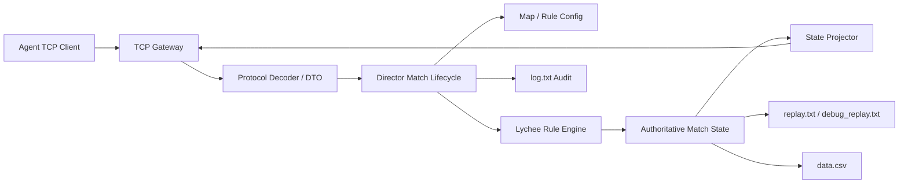

# Lychee Game Server SDD Design

## 1. 背景与输入

本文面向《一骑红尘：荔枝争运战》游戏服务端开发，输入来源为：

- `team-agent-document/一骑红尘：荔枝争运战 游戏逻辑设计文档.md`
- `team-agent-document/一骑红尘：荔枝争运战 通信协议.md`
- `team-agent-document/一骑红尘：荔枝争运战 游戏逻辑设计文档附录.md`
- `Lychee-Arena-Server/docs/backend-design.md`
- `Lychee-Arena-Server/server/src/main/resources/game-default.yaml`
- `Lychee-Arena-Server/server/src/main/resources/lychee-rule-set.json`

本文将 SDD 用作设计驱动开发流程：先固化服务端设计，再拆实施计划，再按任务执行 TDD 与评审。后续如果采用 Subagent-Driven Development，每个实现任务都应由独立任务上下文执行，并经过规则符合性评审和代码质量评审。

## 2. 目标与非目标

目标：

- 在现有 `Lychee-Arena-Server/server` Java 服务端上完成规则收敛，不重写项目。
- 服务端是权威裁判，负责 TCP 协议、动作收集、每帧结算、公平裁决、状态下发、回放、CSV 和审计日志。
- 所有实时规则以 `round` 为准，`tick = round - 1` 仅用于兼容或回放定位。
- 同一 seed、同一地图、同一动作序列必须完全可复现。
- 对外协议严格遵循 5 位 UTF-8 JSON body 字节长度前缀和 `msg_name/msg_data` 外层格式。
- 实时 `start/inquire/over` 不泄露完整 seed、完整未来天气、未来任务或敌方未公开动作。
- 回放和审计输出保留完整裁判复核信息。

非目标：

- 不开发参赛客户端策略。
- 不开发前端回放播放器的新 UI。
- 不新增游戏规则、动作枚举、协议字段或资源类型来绕过文档规则。
- 不通过地图变体改变路线拓扑、处理点、核心节点、计分公式或结算阶段。

## 3. 当前工程判断

现有服务端技术栈为 Java 8、Maven、Netty、FastJSON、SnakeYAML、Log4j2、JUnit 5。核心目录：

- `server/src/main/java/com/huawei/game/server`：TCP 服务、连接处理、`Director` 对局编排。
- `server/src/main/java/com/huawei/game/message`：协议 envelope、长度前缀解码、下行消息。
- `server/src/main/java/com/huawei/game/model`：registration、ready、action 入站 DTO。
- `server/src/main/java/com/huawei/game/action`：动作类型与动作模型。
- `server/src/main/java/com/huawei/game/config`：启动配置、地图加载、规则集加载、输出路径。
- `server/src/main/java/com/huawei/game/Game`：规则状态、地图、回合、荔枝玩法规则服务。
- `server/src/main/java/com/huawei/game/replay`：回放输出。
- `server/src/test/java`：协议、地图、规则、回放、审计和生命周期测试。

现有 `LycheeGameRoleKeeper` 已承担大量规则编排，并已拆出 `LycheeTaskService`、`LycheeGuardService`、`LycheeWindowContestService`、`LycheeScoringService`、`LycheeBountyService`、`LycheeWeatherFreshnessService` 等服务。设计上继续复用这些边界，后续只在风险高或文件过大的局部做定向拆分。

## 4. 方案选择

### 方案 A：现有服务端增量收敛，推荐

保留 `Director + GameRoleKeeper + Lychee*Service` 的主干，按规则文档补齐协议、配置、结算顺序和测试覆盖。优点是风险最低，可复用现有实现、样例、测试和回放工具。缺点是 `LycheeGameRoleKeeper` 仍偏大，需要在后续计划中控制新增复杂度。

### 方案 B：先大拆规则引擎

把规则完全拆成 `ActionNormalizer`、`ActionValidator`、`MovementRule`、`FreshnessRule`、`ContestRule`、`TaskRule` 等多个执行器后再补规则。优点是长期结构清晰，缺点是当前规则量大、边界多，重构期间容易引入回归。

### 方案 C：从零重写服务端

重新实现 TCP、生命周期、规则引擎、回放和测试。优点是架构可以重新设计，缺点是会浪费现有可用代码与测试，交付风险最高。

结论：采用方案 A。后续实施计划按“可验证的增量规则闭环”推进，每个任务只触碰必要文件；当某个子域必须新增复杂逻辑时，再局部抽出服务类。

## 5. 总体架构



### 5.1 TCP Gateway

职责：

- 接收两个参赛 Agent 的 TCP 长连接。
- 以 5 位 ASCII 数字读取 JSON body UTF-8 字节长度。
- 处理粘包、分包、连续帧和非法长度。
- 解析 `msg_name/msg_data` envelope。
- 将 `registration/ready/action` 转交 `Director`。
- 写回 `start/inquire/error/over`。

约束：

- 长度必须按 UTF-8 字节数计算，不使用 Java `String.length()` 判断 body 长度。
- JSON 解析失败、长度前缀错误、未知消息名、`matchId` 或 `round` 不匹配等协议级错误立即返回 `error`。
- 业务规则拒绝通常进入下一帧 `inquire.actionResults/events`，除非该包没有进入规则结算。

### 5.2 Protocol DTO

入站消息：

- `GameRegistration`
- `GameReady`
- `GameActions`
- `RoleAction`

下行消息：

- `GameStartMessage`
- `GameInquireMessage`
- `GameOverMessage`
- `GameErrorMessage`

协议模型应覆盖以下关键字段：`matchId`、`rulesVersion`、`seedHash`、`round`、`tick`、`phase`、`players`、`nodes`、`edges`、`weather`、`tasks`、`bounties`、`contests`、`events`、`actionResults`、`scorePreview`。

### 5.3 Match Lifecycle

状态机：

```text
IDLE -> STATING -> RUNNING -> OVER
```

关键流程：

1. `Director.reset()` 读取 `game-default.yaml`、地图、规则集、输出路径，生成或绑定 seed。
2. `registerPlayer()` 收集两个玩家元数据，按配置或 seed 策略分配红蓝方。
3. `startMatch()` 初始化地图、队伍状态、天气、任务、障碍、回放 start，并广播 `start`。
4. `playerReady()` 收齐 ready 后进入 RUNNING 并广播第 1 帧 `inquire`。
5. `playerAction()` 在每个 round 的接收窗口内收集动作。
6. round 超时后缺失玩家补系统等待，执行权威结算。
7. 每帧写回放 round、发送下一帧 `inquire`。
8. 双方交付、退赛或第 600 帧到达后生成 `over`、`data.csv` 和最终回放。

## 6. 配置设计

### 6.1 地图配置

运行时地图来源为 `map_config.json` 或启动参数 `--map` 指定的兼容 JSON。地图配置负责空间、视觉和 gameplay 点位绑定：

- `grid`、`map`、`layers`、`legend`
- `nodes`
- `edges`
- `routePaths`
- `weatherRegionRule`
- `gameplay.roles`
- `gameplay.resources`
- `gameplay.processNodes`
- `gameplay.taskCandidates`
- `gameplay.routeTaskBuckets`
- `gameplay.obstacleCandidateNodeIds`

地图变体只允许改变距离、S02-S13 坐标、路线折线、图层、天气区域、资源投放点、任务候选点、路线任务桶和障碍候选点。

地图加载必须校验：

- 节点集合固定为 S01-S15。
- S01、S14、S15 唯一且功能固定。
- 所有 edge 端点存在，路线拓扑、路线类型和双向配置符合固定规则。
- `routePaths` 与 edge 对齐。
- `gameplay.processNodes` 与固定处理点一致。
- 资源类型、数量和领取时间符合固定规则。
- 起点到终点可达，三条主路线存在。
- S15 不挂载争斗功能。
- 天气区域声明完整。
- 校验失败则比赛不能启动。

### 6.2 规则配置

`lychee-rule-set.json` 是通用玩法参数来源，覆盖：

- 初始好果、坏果、鲜度、小分队人手、护卫行动点。
- 路线通行成本和鲜度损耗。
- 资源效果。
- 天气池、天气窗口、预告时长。
- 处理点耗时。
- 设卡、防守值、风化。
- 强制通行时间税。
- 窗口拍数、克制关系、平局冷却。
- 小分队成本、延迟、落地顺序。
- 任务刷新、任务模板、任务公平校验。
- 破关悬赏。
- 宫宴冲刺和终局急策。
- 道路障碍。
- 安全区、惩罚、失联退赛。

一局开始后地图和规则配置固定，不做局内热更新。

## 7. 权威状态模型

核心状态分为四层。

比赛层：

- `matchId`
- `rulesVersion`
- `seed` 和 `seedHash`
- `round`
- `phase`
- `rushActive`
- `over`

队伍层：

- `playerId`、`teamId`、`playerName`
- `state`
- `currentNodeId`、`nextNodeId`、`routeEdgeId`
- `moveDirection`
- `edgeProgressMs`、`edgeTotalMs`、`edgeProgressPermille`
- `freshness`
- `goodFruit`、`frozenGoodFruit`、`badFruit`
- `resources`
- `squadAvailable`、`squadInFlight`
- `guardActionPoint`
- `verified`、`delivered`、`retired`
- `missingActionRounds`
- `illegalActionCount`
- `penaltyScore`
- `currentProcess`
- route stats

地图动态层：

- 节点资源库存。
- 道路障碍与清障残留。
- 设卡状态。
- 探路标记。
- 任务、悬赏、窗口、冷却对象。

输出层：

- `events`
- `actionResults`
- `scorePreview`
- replay frames
- CSV rows
- audit log records

## 8. 每帧结算设计

服务端每 1 秒结算一次。动作接收窗口到期后，不因双方提前提交就提前结算。第 N 帧 `action.round = N` 的处理结果在第 N+1 帧 `inquire.actionResults/events` 下发。

权威结算顺序固定为：

1. 收集双方提交的动作。
2. 判定超时、失联、退赛。
3. 推进已存在持续效果，例如马类、疾行令、护果令。
4. 清理过期探路标记。
5. 记录本帧开始时已有设卡的风化前防守快照。
6. 结算本帧设卡风化。
7. 判定是否进入宫宴冲刺。
8. 结算本帧开始时已经到期的普通任务。
9. 按风化前快照和风化后存活状态判定破关悬赏。
10. 处理本帧到达生效帧的在途小分队战术。
11. 处理已有窗口的出牌。
12. 受理本帧提交的小分队战术。
13. 识别公共对象争夺并创建窗口，包含资源领取打断。
14. 对未进入窗口的普通处理动作锁定成本，并拒绝同帧同对象冲突。
15. 按公平主动作顺序逐队执行本帧主动作。
16. 对未交付队伍结算本帧鲜度损耗和好果转坏果。
17. 若本帧是普通任务刷新帧，尝试刷新普通任务。
18. 生成公开事件日志、状态投影、回放和下一帧状态。

这个顺序必须作为实现和测试的主轴。任何规则修改都要说明插入位置。

## 9. 动作模型

每帧动作按类别限制：

- 主车队动作最多 1 个。
- 小分队动作最多 1 个。
- 窗口出牌动作最多 1 个。
- 终局急策动作最多 1 个。

同类动作超上限时，该类别全部失败，不从中挑选合法动作。

主车队动作：

- `MOVE`
- `WAIT`
- `DELIVER`
- `SET_GUARD`
- `BREAK_GUARD`
- `FORCED_PASS`
- `CLAIM_RESOURCE`
- `USE_RESOURCE`
- `CLAIM_TASK`
- `VERIFY_GATE`
- `CLEAR`
- `PROCESS`
- `dock`

小分队动作：

- `SQUAD_SCOUT`
- `SQUAD_CLEAR`
- `SQUAD_REINFORCE`
- `SQUAD_WEAKEN`

窗口动作：

- `WINDOW_CARD`

终局急策：

- `RUSH_SPEED`
- `RUSH_PROTECT`
- `BREAK_ORDER`

`BREAK_ORDER` 只能绑定在 `BREAK_GUARD` 或 `VERIFY_GATE` 上，不能独立作为主动作产生规则效果。

## 10. 核心规则模块

### 10.1 移动与路线

移动使用当前局 `edges[].distance` 和路线类型成本计算：

```text
edgeTotalMs = ceil(edge.distance * routeTypeCostMs)
tickProgressMs = floor(currentSpeed * 1000 / currentWeatherRouteMultiplier)
```

车队到站当帧只完成位置更新，目标节点动作从下一结算帧开始提交。

路线边上支持：

- 继续向 `nextNodeId` 前进。
- 主动 `WAIT` 暂停，保留 `edgeProgressMs`。
- 缺失动作或空动作心跳时系统等待续行。
- 从 `currentNodeId` 改道到其他合法相邻节点，旧边进度清零。

当前版本不支持原路返回递减 `edgeProgressMs`。

### 10.2 鲜度与好果

每帧结束对未交付队伍结算鲜度：

```text
freshnessLoss = baseLoss * weatherFreshnessMultiplier * rushFreshnessMultiplier
```

鲜度低于 90、80、70、60、50、40、30、20、10 的首次阈值时，1 篓好果转坏果。先扣可支配好果，不足时扣冻结好果。扣到冻结好果会使相关处理进入 `COST_BANKRUPT`，不产生收益。

`ICE_BOX` 在第 15 步主动作结算时生效，先于本帧鲜度损耗；鲜度小于等于 0 时不能使用。

### 10.3 资源与读条

读条动作统一通过 `currentProcess` 表示，包含动作、对象键、目标节点、开始帧、总帧数、剩余帧数和冻结成本。

公共对象键：

- `TASK:{taskId}`
- `RESOURCE:{targetNodeId}:{resourceType}`
- `GATE:{targetNodeId}`
- `PROCESS:{targetNodeId}:{processType}`
- `OBSTACLE:{targetNodeId}`
- `PASS:{targetNodeId}:{guardOwnerTeamId}`
- `PASS:{targetNodeId}:OBSTACLE:{teamId}`

资源领取是唯一允许被后续动作打断的处理流程。同一资源第 1 次打断创建资源窗口；第 2 次起返回 `OBJECT_BUSY`。

### 10.4 设卡、攻坚与强制通行

`SET_GUARD` 在目标节点读条 4 秒后生成设卡；同帧完成的设卡从下一帧开始阻挡。每队有效设卡上限为 2。

`BREAK_GUARD` 只处理设卡，不移动车队：

```text
attack = goodFruit * 2 + badFruit * 3 + breakOrderBonus
```

攻坚成功清除设卡，失败削减防守值并使攻方休整。

`FORCED_PASS` 用于穿过相邻节点的敌方设卡或道路障碍。总耗时由额外时间税和正常路线移动组成，时间税不能替代路线移动。遇敌方有效设卡时创建 PASS 窗口；只有道路障碍时不创建 PASS 窗口。

### 10.5 窗口争夺

窗口固定 3 拍，每拍 1 帧。窗口类型：

- `RESOURCE`
- `TASK`
- `GATE`
- `DOCK`
- `PASS`
- `OBSTACLE`

窗口牌：

- `YAN_DIE`
- `QIANG_XING`
- `XIAN_GONG`
- `BING_ZHENG`
- `ABSTAIN`

出牌成本在亮牌结算时扣除。成本不足时该拍按弃权处理。

3 拍后胜点高者获得窗口权益；平局不分配权益，不使用二级规则强行判胜。重复平局达到上限后，对象进入冷却：普通对象 18 帧，宫门 6 帧。

### 10.6 小分队与探路

每队初始小分队人手为 8。提交成功立即扣人手，生效帧为：

```text
arriveRound = submitRound + min(15, max(3, ceil(chebyshevDistance / 3))) + weatherExtra
```

同一帧多个在途小分队落地顺序：

1. `SQUAD_REINFORCE`
2. `SQUAD_WEAKEN`
3. `SQUAD_CLEAR`
4. `SQUAD_SCOUT`

探路标记保留 45 帧，同队同节点 FIFO 消耗。一次适用处理最多消耗 1 个，处理时间减少 3 帧，最低 2 帧。

### 10.7 皇榜任务与悬赏

普通任务模板固定为 T01、T02、T04、T06、T08、T11、T12、T13、T14。刷新帧为 1、100、200、300、400，每批默认面向 ROAD、WATER、MOUNTAIN 各尝试 1 个任务。

任务刷新必须通过公平校验：

- 不刷在任一队伍脚下。
- 任一队伍到目标最短理论通行时间不少于 10 秒。
- 双方最短理论通行时间差不超过 30 秒。
- 双方都能在任务到期前到达并完成。
- 同批目标不重复。

T04 可从目标障碍节点或相邻节点处理。非 T04 方式清掉 T04 目标时，该任务 `FAILED_TARGET_LOST`，不给分、不补刷。

破关悬赏由有效设卡持续、防守成功或关键关隘交锋触发。悬赏分只发给成功攻破设卡且本帧开始分数落后的攻方。

### 10.8 宫宴冲刺、验核与交付

RUSH 触发：

- 第 390 帧前不触发。
- 第 450 帧强制触发。
- 第 390-449 帧内，任一队伍到达 S14 或接近终点时触发。

RUSH 触发后：

- 双方 `phase = RUSH`。
- 每队获得 1 次终局急策资格。
- 开放 S14 `VERIFY_GATE`。
- 禁止新提交远程小分队战术。
- 不刷新额外得分任务。

宫门验核只在 RUSH 阶段、S14、未验核状态下可提交。验核完成后 `verified` 从下一帧生效。第 600 帧完成验核没有后续交付机会。

交付只在 S15 且 `verified=true`、`goodFruit>0`、`freshness>0`、未交付时成功。交付成功锁定交付帧、交付好果和交付鲜度。单方交付不结束比赛，双方交付后当前帧生成 `over`。

### 10.9 计分、惩罚与退赛

最终分：

```text
totalScore = max(0, deliveryScore + goodFruitScore + freshnessScore + timeScore + taskScore + bountyScore - penaltyScore)
```

未交付时，送达、好果、鲜度、用时均为 0；任务分最高 80，不应用里程碑；悬赏分最高 25，不应用完成奖励。

惩罚：

- 普通非法动作前 5 次免费，第 6 次起每次 1 分，上限 20。
- 已交付后违规动作每次 5 分，上限 30。
- 业务拒绝不计非法动作，不扣惩罚。

失联：

- 连续 10 帧未收到 action 记录 `DISCONNECT_WARNING`。
- 连续 60 帧未收到 action 进入 `RETIRED` 并结束比赛。
- 单方退赛判负，双方同帧退赛为无效局。

## 11. 公平与确定性

服务端不得按 `teamId`、`playerId`、玩家列表顺序、TCP 包到达顺序或 action 到达顺序分配权益。

普通稳定裁决输入：

- seed
- round
- resolve phase
- objectKey
- unordered player set

独占冲突公平账本用于对象锁、小分队清障、增援、削弱等真实争用，按以下顺序裁决：

1. 全局胜出次数少者优先。
2. 同阶段胜出次数少者优先。
3. 同对象胜出次数少者优先。
4. 普通稳定裁决兜底。

账本只在真实冲突产生胜者后写入。

## 12. 状态投影与可见性

内部规则状态不直接作为协议对象暴露。`State Projector` 负责：

- 生成每个玩家视角的 `inquire`。
- 生成权威全量 replay round。
- 生成 `over` 和 `scoreDetail`。
- 控制隐藏信息。

实时协议不下发：

- 完整 seed。
- 完整未来天气序列。
- 未来任务刷新结果。
- 敌方未公开动作。
- 未来回放帧。

实时 `start` 下发 `seedHash`；完整 seed 只写入回放 start。

## 13. 回放、CSV 与审计

`replay.txt`：

- 每行一个完整 JSON。
- 不带 5 位 TCP 长度前缀。
- 第一行为 `type=start`。
- 中间每帧为 `type=round`。
- 最后一行为 `type=over`。
- 包含完整 seed、完整天气、权威状态、事件和最终结算。

`debug_replay.txt`：

- 面向裁判审计。
- 保留原始动作、服务端事件和调试帧。
- 不通过实时接口下发。

`data.csv`：

- 比赛结束后输出。
- 包含总分、分项分、在线状态、路线统计、主路线、进度和玩家名。
- 路线统计只用于赛后分析，不参与最终得分。

`log.txt`：

- 记录连接、收包、发包、动作快照、结算事件和协议错误。
- seed、token、password、secret、credential、authorization 等字段必须脱敏。

## 14. 测试策略

后续实施计划应按 TDD 组织，每个任务先写失败测试，再实现最小代码，再跑对应测试。

测试分层：

- 协议 framing：UTF-8 字节长度、粘包、分包、连续帧、非法长度、非法 JSON。
- 消息流程：registration、start、ready、inquire、action、over、error。
- 地图加载：基础地图、地图变体、拓扑固定、gameplay 点位绑定、校验失败。
- 移动：路线成本、天气倍率、主动等待、系统等待续行、改道清零、到站下一帧动作。
- 鲜度：天气损耗、冰鉴先于损耗、阈值转坏、冻结好果破产。
- 资源读条：领取、使用、对象锁、资源打断、`OBJECT_BUSY`。
- 设卡与强制通行：设卡下一帧阻挡、攻坚、风化、时间税重算、PASS 窗口。
- 窗口争夺：三拍、成本扣除、平局、重复平局冷却、保护处理。
- 小分队：消耗、延迟、落地顺序、目标二次校验、探路 FIFO。
- 任务与悬赏：刷新公平校验、T04 目标丢失、窗口暂停、悬赏生成与领取。
- RUSH、验核、交付：触发时点、急策限制、验核下一帧生效、交付快照。
- 计分：已交付、未交付、任务里程碑、悬赏完成奖励、惩罚上限。
- 失联退赛：警告、退赛、清理、单方退赛判负、双方同帧无效。
- 公平确定性：同 seed 同动作复现，不按 playerId 或 action 到达顺序偏置。
- 输出：replay、debug replay、CSV、审计日志字段和脱敏。

## 15. SDD 后续切分建议

后续实施计划按以下阶段拆任务：

1. 基线审计：跑现有测试，形成当前规则覆盖矩阵。
2. 协议与生命周期：补齐 framing、error、round、matchId、重复提交和超时行为。
3. 地图与规则配置：把文档固定项、地图变体边界和校验条件转为测试。
4. 每帧结算主轴：用 18 步顺序建立回归测试，确保规则插入点稳定。
5. 资源、读条、对象锁与窗口：优先覆盖同帧争夺和资源打断。
6. 移动、天气、鲜度与好果：覆盖时间口径和结算先后。
7. 设卡、强制通行、小分队、任务、悬赏、RUSH：按子域逐个闭环。
8. 投影、回放、CSV、审计：保证实时协议、公开回放和裁判审计三者分工清楚。
9. 确定性与公平性：以镜像策略、重复争用和不同 playerId 组合做回归。
10. 打包与运行手册：验证 `java -jar`、`--map`、输出路径和本地对战模式。

## 16. 验收标准

设计验收以规则文档 11.1 为准，并在服务端补齐自动化验证。最小服务端完成标准：

- 可加载默认地图和合法地图变体。
- 可完成完整 TCP 对局流程。
- 每帧按 round 收集和结算动作。
- 所有动作类别限制、业务拒绝和非法动作惩罚符合文档。
- 主车移动、天气、鲜度、资源、读条、窗口、设卡、小分队、任务、悬赏、RUSH、验核、交付、计分、退赛均由服务端权威结算。
- 实时协议字段与通信协议对齐，且不泄露隐藏信息。
- replay、debug replay、data.csv、log.txt 输出稳定可审计。
- 同 seed 下结果完全一致。
- 公平裁决不依赖阵营、玩家编号、玩家列表或网络到达顺序。

## 17. 风险与处理

- 规则文档很细，单次实现容易遗漏边界。处理方式是用覆盖矩阵和分任务 TDD 推进。
- `LycheeGameRoleKeeper` 已较大，继续堆叠会增加维护成本。处理方式是在新增复杂子域时抽服务类，而不是做一次性大重构。
- 协议 framing 当前仍依赖字符串管线。处理方式是先补 UTF-8 字节级测试，再考虑 ByteBuf 级 decoder。
- 地图配置和规则配置边界容易混用。处理方式是地图只表达空间和玩法点位，通用机制只从规则集读取。
- 公平裁决容易出现隐性 playerId 偏置。处理方式是使用无序玩家集合、稳定裁决和三层账本测试。

## 18. 评审结论

推荐按方案 A 进入实施计划：保留现有 Java 服务端主干，以文档规则为权威规格，按 SDD/TDD 分阶段补齐测试和实现。设计通过后，下一步产出实施计划，计划中会列出每个任务触碰的文件、失败测试、实现步骤和验证命令。
