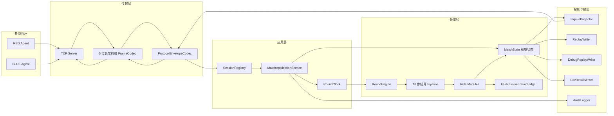
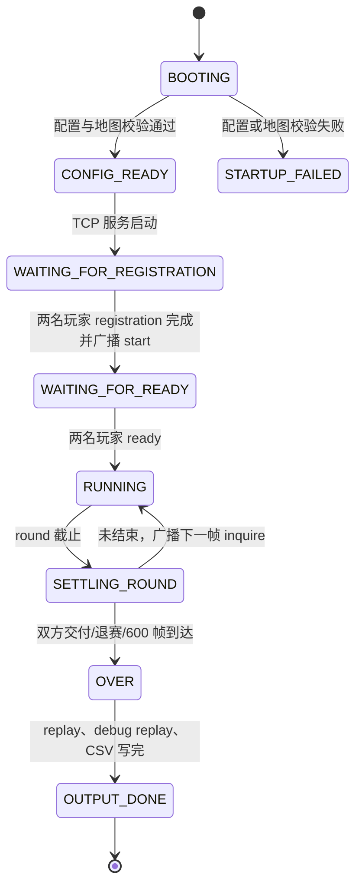
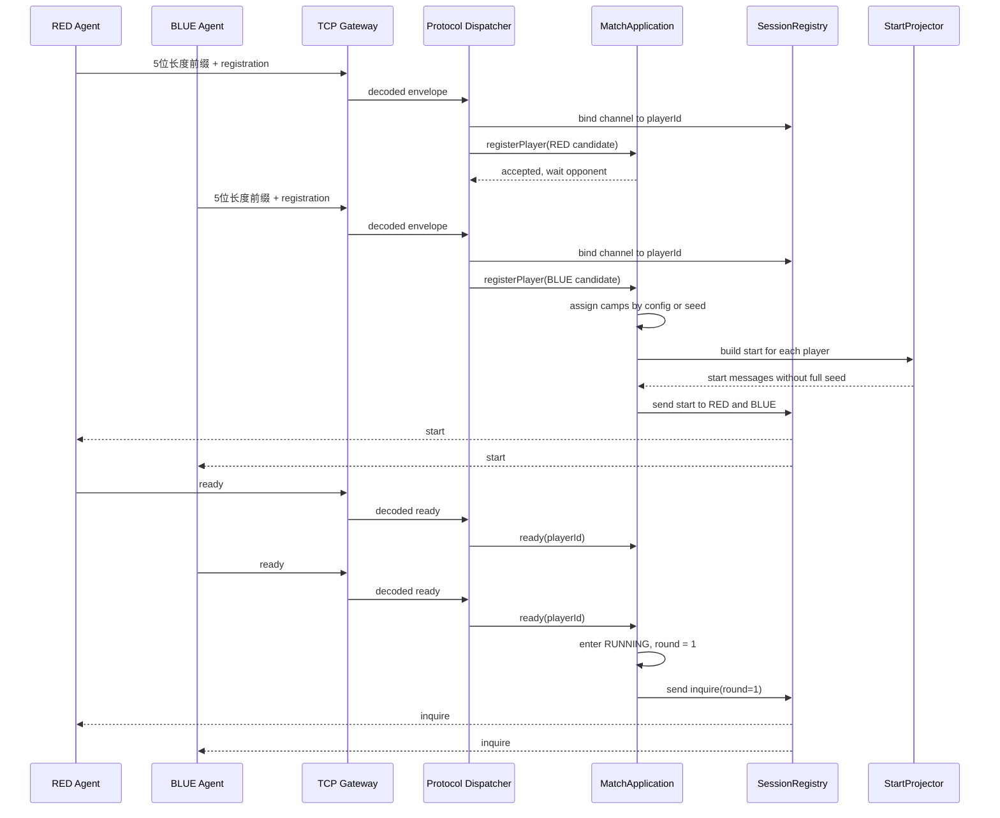
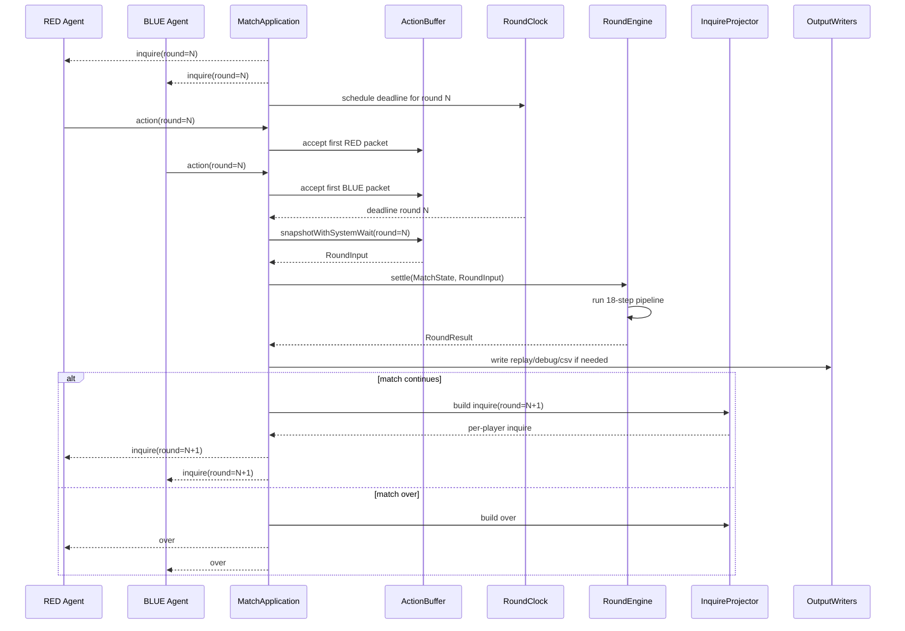
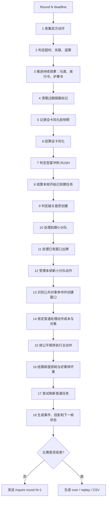
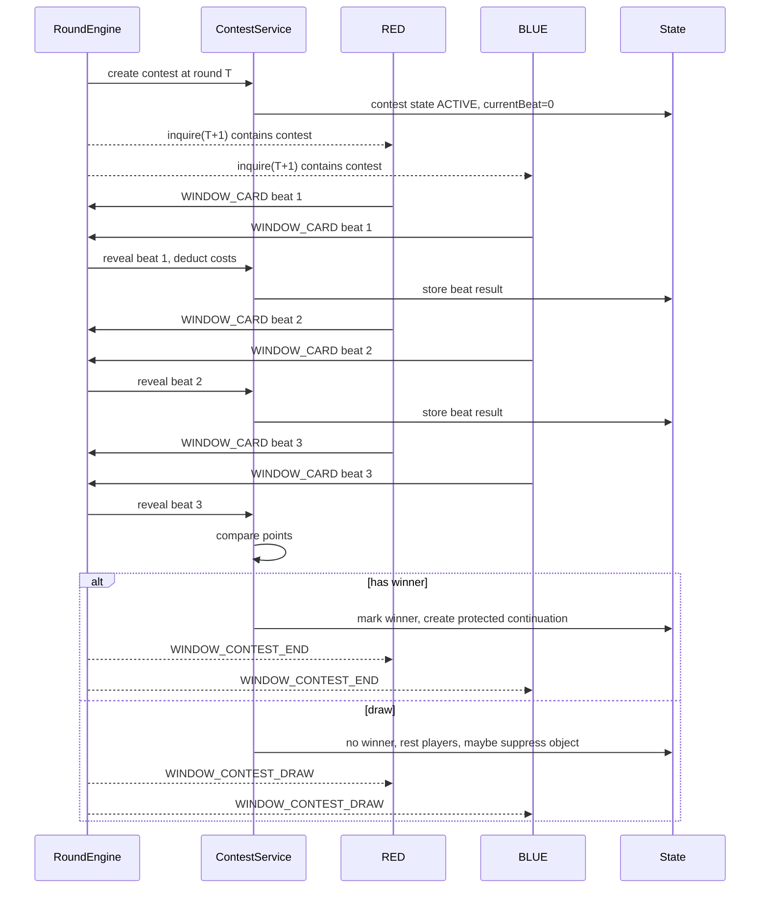

# 《一骑红尘：荔枝争运战》游戏服务端设计文档

版本：2026-06-23  
目标：从零开发游戏服务端，不参考既有服务端代码结构。  
输入：`team-agent-document` 下的游戏逻辑设计文档、通信协议、附录、地图配置和样例。

---

## 1. 文档目标

本文用于支撑后续 SDD 开发。它不是概念稿，而是服务端实现规格：开发者应能据此拆分模块、编写测试、实现协议、实现每帧结算、生成回放和完成验收。

本文坚持三个原则：

1. 服务端是唯一权威裁判。客户端只提交动作，不参与结算裁决。
2. 所有规则以结算帧 `round` 为准，不用真实墙钟时间做规则判断。
3. 同一 `seed`、同一地图、同一动作序列必须得到完全一致的结果。

本文不约束语言必须为 Java，但推荐 Java + Netty + Maven 作为比赛环境友好的实现组合。

---

## 2. 规格来源

权威规则来源如下：

| 文件 | 用途 |
|---|---|
| `一骑红尘：荔枝争运战 游戏逻辑设计文档.md` | 游戏规则、结算顺序、地图规则、动作、计分、验收标准 |
| `一骑红尘：荔枝争运战 通信协议.md` | TCP 协议、消息格式、字段、动作 payload、错误反馈 |
| `一骑红尘：荔枝争运战 游戏逻辑设计文档附录.md` | 动作空间、术语表、字段和枚举速查 |
| `Map/map_config.json` 和 `地图/map_config*.json` | 地图 JSON 结构和地图变体 |
| `样例/server/map_config*.json` | 服务端启动地图样例 |

如果本文与上述文档冲突，以上述文档为准，并先修订本文。

---

## 3. 服务端边界

服务端负责：

- TCP 长连接接入。
- 5 位 UTF-8 JSON 字节长度前缀 framing。
- `registration/start/ready/inquire/action/over/error` 协议流程。
- 双人注册、红蓝方分配、ready 同步。
- 地图和规则配置加载与校验。
- 每 1 秒一个 `round` 的动作收集和权威结算。
- 所有动作合法性判断。
- 业务拒绝、非法动作、交付后违规和失联退赛。
- 公平裁决和可复现随机。
- 实时状态投影。
- `replay.txt`、`debug_replay.txt`、`data.csv`、`log.txt` 输出。

服务端不负责：

- 玩家策略 AI。
- 观战前端或回放播放器 UI。
- 平台排名。
- 局内热更新规则。
- 两人以上对局。

---

## 4. 总体架构图



架构要点：

- `transport` 不知道游戏规则，只负责收发和解析消息边界。
- `protocol` 不做规则结算，只校验消息壳和 DTO。
- `match` 负责生命周期和回合调度。
- `engine` 负责固定结算顺序。
- `rules` 只通过 `RoundContext` 修改权威状态和产出事件。
- `projection` 负责把权威状态变成实时协议或回放格式。

---

## 5. 推荐包结构

建议包结构用目录树表达即可，后续创建工程时保持分层边界清晰：

```text
com.lychee.server
  bootstrap
  config
  transport
  protocol
  session
  match
  domain
    action
    event
    fair
    map
    player
    process
    replay
    rule
    score
    weather
  engine
    pipeline
    rules
  projection
  output
  audit
  testkit
```

| 包 | 核心职责 |
|---|---|
| `bootstrap` | 启动参数、配置路径、服务启动和优雅关闭 |
| `config` | 读取、绑定、校验地图与规则配置 |
| `transport` | TCP 连接、分包粘包、长度前缀编码解码 |
| `protocol` | 协议 envelope、入站命令、出站消息、协议级错误 |
| `session` | 连接地址、通道、playerId 绑定和消息发送 |
| `match` | 注册、ready、动作接收、round 调度、比赛结束 |
| `domain` | `MatchState`、`PlayerState`、`NodeState` 等纯模型 |
| `engine` | 18 步结算流程和规则模块编排 |
| `projection` | `start/inquire/over`、回放帧、隐藏信息裁剪 |
| `output` | 文件输出 |
| `audit` | 裁判排障日志 |
| `testkit` | 测试用地图、动作脚本、断言工具 |

---

## 6. 对局生命周期状态图



状态约束：

- `WAITING_FOR_REGISTRATION` 只接受 `registration`。
- `WAITING_FOR_READY` 只接受已注册玩家的 `ready`。
- `RUNNING` 接受当前 `round` 的 `action`。
- `SETTLING_ROUND` 不接收本轮新动作，迟到动作返回协议级错误。
- `OVER` 后不再接收动作。

---

## 7. 注册到开局时序图



实现要求：

- `registration` 之后通道与 `playerId` 绑定。
- 同一 `playerId` 从其他通道发 `ready/action` 必须拒绝。
- `start` 中只发 `seedHash`，不发完整 `seed`。
- 两名玩家都 ready 后才发第一帧 `inquire`。

---

## 8. 每帧动作时序图



关键要求：

- 不因双方提前提交而提前结算。
- 缺失动作在 deadline 时补系统等待。
- `round=N` 的结果在 `inquire(round=N+1)` 的 `actionResults/events` 中体现。
- 重复提交同一 `round` 的 action，第一包有效，后续返回 `DUPLICATE_ACTION`。

---

## 9. 协议分层校验

协议级错误不会进入规则结算，也不计非法动作惩罚。

| 顺序 | 层级 | 校验项 | 失败错误 | 成功后去向 |
|---:|---|---|---|---|
| 1 | Frame | 前 5 字节必须是 ASCII 数字 | `INVALID_LENGTH_PREFIX` | 读取 body 长度 |
| 2 | Frame | body 字节数不能超过 99999 | `MESSAGE_TOO_LARGE` | 等待完整 body |
| 3 | Frame | body 必须是合法 UTF-8 | `INVALID_UTF8` | JSON 解析 |
| 4 | Envelope | JSON 必须可解析 | `INVALID_JSON` | 读取 envelope |
| 5 | Envelope | 必须包含 `msg_name` 和 `msg_data` | `INVALID_ENVELOPE` | 消息路由 |
| 6 | Envelope | `msg_name` 必须属于支持集合 | `UNSUPPORTED_MESSAGE_TYPE` | 生命周期校验 |
| 7 | Lifecycle | 当前状态允许该消息 | `MESSAGE_NOT_ALLOWED` | DTO 反序列化 |
| 8 | Session | `playerId` 与连接绑定一致 | `PLAYER_ADDRESS_MISMATCH` | 对局校验 |
| 9 | Match | `matchId` 必须等于当前对局 | `MATCH_ID_MISMATCH` | 帧校验 |
| 10 | Round | `action.round` 必须等于当前帧 | `ROUND_MISMATCH` | 重复校验 |
| 11 | ActionBuffer | 同玩家同帧只接收第一包 | `DUPLICATE_ACTION` | 进入 `MatchApplication` 或 `ActionBuffer` |

---

## 10. 权威领域模型

### 10.1 MatchState

`MatchState` 是整局比赛的权威聚合。

| 字段 | 说明 |
|---|---|
| `matchId` | 对局编号 |
| `rulesVersion` | 规则版本 |
| `seed` | 完整随机种子，只写回放 |
| `seedHash` | 实时协议公开摘要 |
| `round` | 当前结算帧，从 1 开始 |
| `phase` | `NORMAL`、`RUSH`、`ENDED` |
| `status` | 生命周期状态 |
| `playersById` | 玩家状态 |
| `teamToPlayerId` | 红蓝队伍映射 |
| `mapState` | 静态地图和动态节点状态 |
| `ruleSet` | 本局冻结规则配置 |
| `weatherSchedule` | 完整天气序列，实时只投影当前和预告 |
| `tasks` | 当前任务实例 |
| `bounties` | 当前破关悬赏 |
| `contests` | 当前窗口和冷却对象 |
| `objectLocks` | 正在处理的公共对象锁 |
| `fairLedger` | 公平账本 |
| `overSnapshot` | 终局快照 |

### 10.2 PlayerState

| 字段 | 说明 |
|---|---|
| `playerId/teamId/playerName/version` | 身份信息 |
| `state` | `IDLE/MOVING/PROCESSING/...` |
| `currentNodeId/nextNodeId/routeEdgeId` | 位置 |
| `moveDirection` | `NONE/FORWARD/PAUSED` |
| `edgeProgressMs/edgeTotalMs/edgeProgressPermille` | 路线边进度 |
| `freshness` | 鲜度，保留小数 |
| `goodFruit/frozenGoodFruit/badFruit` | 果品 |
| `resources` | 队伍资源库存 |
| `buffs` | 马类、疾行令、护果令等 |
| `squadAvailable/squadInFlight/squadOrders` | 小分队 |
| `guardActionPoint` | 护卫行动点 |
| `verified/delivered/retired` | 验核、交付、退赛 |
| `missingActionRounds` | 连续缺失动作帧数 |
| `illegalActionCount` | 普通非法动作次数 |
| `ordinaryPenaltyScore/postDeliverPenaltyScore` | 惩罚分 |
| `currentProcess` | 当前读条 |
| `forcedPassState` | 强制通行中的时间税和路线段 |
| `triggeredFreshnessThresholds` | 已触发好果转坏果阈值 |
| `routeStats` | CSV 路线统计 |

### 10.3 NodeState

| 字段 | 说明 |
|---|---|
| `nodeId` | 站点编号 |
| `resourceStock` | 节点公开资源库存 |
| `guard` | 主动设卡状态 |
| `obstacle` | 道路障碍状态 |
| `obstacleResidue` | 清障残留税 |
| `scoutMarkers` | 探路标记队列 |
| `processConfig` | 固定处理点配置 |

### 10.4 ProcessState

| 字段 | 说明 |
|---|---|
| `actionType` | 读条来源动作 |
| `objectKey` | 公共对象键 |
| `targetNodeId` | 目标节点 |
| `taskId/resourceType/processType` | 业务绑定字段 |
| `startedRound` | 开始帧 |
| `totalRound/remainRound` | 总耗时和剩余耗时 |
| `frozenCost` | 冻结成本 |
| `ownerPlayerId` | 占用方 |
| `protectionKind` | 窗口胜方保护类型 |
| `breakOrderBinding` | 破关令绑定信息 |

---

## 11. 公共对象键和锁

公共对象锁用于防止两个玩家或同一玩家的多个处理流程同时修改同一个对象。锁处理顺序如下：

1. 规则模块根据动作生成 `objectKey`。
2. 若对象可窗口化，且双方同帧争夺同一 `objectKey`，先创建 `WINDOW_CONTEST`，不创建普通读条。
3. 若对象已被非当前玩家锁定，返回业务拒绝 `OBJECT_BUSY`。
4. 若对象未锁定，创建 `currentProcess` 并冻结必要成本。
5. 读条完成前做二次校验，确认目标仍存在、成本仍冻结、位置仍合法。
6. 二次校验失败时释放锁并记录失败事件。
7. 二次校验成功时正式扣除成本、结算收益、释放锁。

| 对象 | objectKey |
|---|---|
| 任务 | `TASK:{taskId}` |
| 资源 | `RESOURCE:{nodeId}:{resourceType}` |
| 宫门验核 | `GATE:{nodeId}` |
| 公开处理点 | `PROCESS:{nodeId}:{processType}` |
| 障碍清理 | `OBSTACLE:{nodeId}` |
| 设卡位 | `GUARD:{nodeId}` |
| 设卡强制通行 | `PASS:{nodeId}:{guardOwnerTeamId}` |
| 障碍强制通行 | `PASS:{nodeId}:OBSTACLE:{teamId}` |
| 小分队清障 | `SQUAD:CLEAR_OBSTACLE:{nodeId}` |
| 小分队设卡防守变化 | `SQUAD:GUARD_DEFENSE_DELTA:{nodeId}` |

锁释放条件：

- 处理完成。
- 处理失败。
- 窗口打断。
- 平局或败北。
- 目标丢失。
- 预留好果不足。
- 玩家退赛。

---

## 12. 18 步结算流程图



实现约束：

- 每条规则必须明确属于哪一步。
- 同帧边界争议一律回到这个顺序判断。
- `USE_RESOURCE`、`DELIVER` 在第 15 步主动作结算时生效。
- 未交付队伍第 16 步结算鲜度。
- 交付成功队伍跳过本帧鲜度损耗。

---

## 13. RoundEngine 伪代码

```java
RoundResult settle(MatchState state, RoundInput input) {
    RoundContext ctx = RoundContext.create(state, input);

    collectActions.apply(state, ctx);
    timeoutAndRetirement.apply(state, ctx);
    buffDuration.apply(state, ctx);
    scoutMarkerExpiration.apply(state, ctx);
    guardSnapshot.apply(state, ctx);
    guardWeathering.apply(state, ctx);
    rushTrigger.apply(state, ctx);
    taskExpiration.apply(state, ctx);
    bountyCreation.apply(state, ctx);
    dueSquadResolution.apply(state, ctx);
    existingContestCards.apply(state, ctx);
    newSquadSubmission.apply(state, ctx);
    contestCreation.apply(state, ctx);
    processLock.apply(state, ctx);
    mainActionResolution.apply(state, ctx);
    freshnessAndFruit.apply(state, ctx);
    taskRefresh.apply(state, ctx);
    projectionAndClose.apply(state, ctx);

    return ctx.toRoundResult();
}
```

`RoundContext` 应包含：

- 当前 `round`。
- 原始动作包。
- 标准化动作。
- 系统等待补包。
- 本帧事件收集器。
- `actionResults` 收集器。
- 公共对象冲突索引。
- 公平裁决器。
- 风化前快照。
- 本帧开始分数快照。
- 输出给 replay/debug 的内部决策记录。

---

## 14. 动作分类和标准化

动作包进入规则结算前必须先标准化为固定 bucket。标准化只做语法和类别约束，不判断位置、库存、路径、任务是否存在等业务条件。

动作类别：

| 类别 | 动作 | 每帧上限 |
|---|---|---:|
| 主车队 | `MOVE/WAIT/DELIVER/SET_GUARD/BREAK_GUARD/FORCED_PASS/CLAIM_RESOURCE/USE_RESOURCE/CLAIM_TASK/VERIFY_GATE/CLEAR/PROCESS/dock` | 1 |
| 小分队 | `SQUAD_SCOUT/SQUAD_CLEAR/SQUAD_REINFORCE/SQUAD_WEAKEN` | 1 |
| 窗口 | `WINDOW_CARD` | 1 |
| 终局急策 | `RUSH_SPEED/RUSH_PROTECT/BREAK_ORDER` | 1 |

`BREAK_ORDER` 只能绑定 `BREAK_GUARD` 或 `VERIFY_GATE`。绑定时既属于主动作参数，也占用终局急策类别额度。

标准化规则：

| 顺序 | 输入情况 | 标准化结果 |
|---:|---|---|
| 1 | `actions` 缺失或不是数组 | 协议错误 `INVALID_PAYLOAD` |
| 2 | `actions: []` | 有效心跳，四个 bucket 均为空 |
| 3 | actionType 不存在于附录动作集合 | 非法动作 `INVALID_ACTION_TYPE` |
| 4 | 必填字段缺失或类型错误 | 非法动作 `INVALID_PAYLOAD` |
| 5 | 同一 bucket 动作数量超过 1 | 非法动作 `INVALID_ACTION_CONFLICT`，该 bucket 不进入结算 |
| 6 | `BREAK_ORDER` 没有绑定动作或绑定类型不允许 | 非法动作 `INVALID_PAYLOAD` |
| 7 | bucket 合法 | 生成 `NormalizedActionSet` 供 18 步结算使用 |

`NormalizedActionSet` 推荐包含 `mainAction`、`squadAction`、`windowCardAction`、`rushTacticAction`、`invalidActions`、`rawPacketId`、`receivedAtSequence`。

---

## 15. 移动规则

移动公式：

```text
edgeTotalMs = ceil(edge.distance * routeTypeCostMs)
tickProgressMs = floor(currentSpeed * 1000 / currentWeatherRouteMultiplier)
edgeProgressMs += tickProgressMs
edgeProgressPermille = floor(edgeProgressMs * 1000 / edgeTotalMs)
```

节点出发判定：

| 判定项 | 不满足时结果 | 满足时结果 |
|---|---|---|
| 玩家当前在节点上 | 转入路线边判定 | 继续下一项 |
| `targetNodeId` 与当前节点相邻 | `TARGET_NOT_REACHABLE` | 继续下一项 |
| 目标节点无敌方设卡和道路障碍 | `MOVE_BLOCKED_BY_GUARD` 或 `MOVE_BLOCKED_BY_OBSTACLE` | 继续下一项 |
| `S14 -> S15` 已完成验核 | `DELIVER_NOT_VERIFIED` | 创建移动状态 |
| 玩家不处于休整、窗口、读条、强制通行等互斥状态 | 对应业务拒绝 | 本帧按公式推进 |

路线边判定：

| 输入 | 结果 |
|---|---|
| `WAIT` | 暂停移动，`edgeProgressMs` 不变 |
| 系统续行或 `targetNodeId == nextNodeId` | 沿原路线继续推进 |
| `targetNodeId` 是 `currentNodeId` 的其他相邻节点 | 改道，旧进度清零，重新计算路线 |
| 其他目标 | `TARGET_NOT_REACHABLE` |

到达处理：

- `edgeProgressMs < edgeTotalMs`：玩家仍在路线边，下一帧默认续行。
- `edgeProgressMs >= edgeTotalMs`：玩家进入目标节点，清空路线状态，下一帧可提交节点动作。
- 同帧到达节点后，不再追加执行节点动作。

---

## 16. 窗口争夺时序图



窗口要点：

- 窗口固定 3 拍，每拍 1 帧。
- 出牌成本在亮牌时扣除。
- 成本不足，该拍按 `ABSTAIN`。
- 平局不使用二级规则强行判胜。
- 重复平局达到上限后进入冷却。

---

## 17. 资源争夺和打断规则

资源领取按以下顺序判定：

| 顺序 | 判定 | 失败或命中结果 |
|---:|---|---|
| 1 | 玩家必须在目标资源节点 | `NOT_AT_TARGET_NODE` |
| 2 | 资源库存必须大于 0 | `RESOURCE_NOT_ENOUGH` |
| 3 | 双方同帧领取同一 `nodeId + resourceType` | 创建 `RESOURCE` 窗口 |
| 4 | 无现有资源领取读条 | 启动领取读条，锁定 `RESOURCE:{nodeId}:{resourceType}` |
| 5 | 已有领取读条，且该资源第一次被后续动作打断 | 中断原领取，创建 `RESOURCE` 窗口 |
| 6 | 已有领取读条，且已被打断过 | `OBJECT_BUSY` |
| 7 | 窗口产生胜方 | 胜方从头开始领取读条 |

资源领取是唯一可被后续动作打断的处理流程。任务、宫门、公开处理点和障碍处理开始后，后续争抢只返回对象忙。

---

## 18. 强制通行规则

实现要点：

- 时间税和路线移动是两个阶段。
- 阻挡失效只影响未支付时间税，不取消正常路线移动。
- 新出现阻挡不提高本次时间税。
- 成功进入目标节点后，必须普通移动离开该节点，才能再次强制通行。

判定和执行阶段：

| 阶段 | 服务端处理 | 失败结果 |
|---|---|---|
| 目标校验 | `targetNodeId` 必须与当前节点相邻 | `TARGET_NOT_REACHABLE` |
| 阻挡校验 | 目标存在敌方设卡或道路障碍 | 无阻挡则业务拒绝 |
| 快照 | 锁定当前有效阻挡快照 | 无 |
| 设卡窗口 | 若存在敌方有效设卡，创建 `PASS` 窗口 | 攻方未胜出则强制通行失败并休整 |
| 时间税 | 根据仍有效阻挡重算剩余 `timeTax` | 无 |
| 等待段 | 支付时间税，期间不执行其他动作 | 等待未完成则保持通行状态 |
| 移动段 | 时间税结束后进入正常路线移动 | 到达前保持路线状态 |
| 完成 | 进入目标节点，写入本次强制通行限制 | 下一次必须先普通移动离开 |

---

## 19. 任务刷新规则

刷新帧为 `1/100/200/300/400`。若当前可直接处理任务数已达到 9 个，本帧不刷新。

候选任务必须同时满足：

| 过滤项 | 要求 |
|---|---|
| 路线桶 | 任务目标同时属于模板候选和 `ROAD/WATER/MOUNTAIN` 当前桶 |
| 脚下限制 | 目标不在任一队当前脚下 |
| 最小到达时间 | 双方理论到达时间均不少于 10 秒 |
| 公平差距 | 双方理论到达时间差不超过 30 秒 |
| 到期可完成 | 双方理论上均可在任务到期前完成 |
| 批次去重 | 同一刷新批次内目标节点不重复 |
| 模板约束 | 任务模板字段、奖励、处理耗时符合规则配置 |

若同一桶尝试次数达到配置上限仍无候选，本桶跳过，不回填其他桶。

T04 特例：

- 目标是障碍节点。
- 合法处理位置为障碍节点和相邻节点。
- 公平距离按最近合法处理位置计算。
- 目标障碍被非 T04 方式清除时，任务 `FAILED_TARGET_LOST`，不给分、不补刷。

---

## 20. RUSH、验核、交付规则

RUSH 在第 7 步判定。满足任一条件即触发，触发后不可回退：

| 条件 | 结果 |
|---|---|
| `round < 390` | 不触发 |
| `round >= 450` | 触发 RUSH |
| 任一队已到达 `S14` | 触发 RUSH |
| 任一队接近终点且不在 `S11/S12/S13` | 触发 RUSH |
| 其他情况 | 不触发 |

RUSH 触发后的规则变化：

| 规则项 | 变化 |
|---|---|
| 终局急策 | 开放 `RUSH_SPEED/RUSH_PROTECT/BREAK_ORDER` |
| 验核 | 开放 `S14 VERIFY_GATE` |
| 小分队 | 禁止提交新的小分队动作，已到期小分队仍按结算顺序处理 |
| 任务 | 不改变已存在任务的完成、失败、过期逻辑 |
| 交付 | 必须先完成验核，再移动到 `S15`，最后提交 `DELIVER` |

验核注意：

- NORMAL 阶段不能验核。
- 验核完成后下一帧才生效。
- 第 600 帧完成验核没有后续交付机会。

---

## 21. 交付和计分规则

交付条件：

- 当前节点为 S15。
- `verified = true`。
- 未交付。
- `goodFruit > 0`。
- `freshness > 0`。
- 不在移动、窗口、休整、强制通行、处理或验核中。

计分路径：

| 玩家状态 | 计分规则 |
|---|---|
| 未交付 | 送达分、好果分、鲜度分、用时分均为 0；任务分 `min(rawTask, 80)`；悬赏分 `min(rawBounty, 25)` |
| 已交付 | 使用交付快照计算送达分、好果分、鲜度分、用时分、任务分和悬赏分 |

已交付公式：

| 分项 | 公式 |
|---|---|
| 送达分 | `min(240, 120 + floor(rawTask * 4 / 3))` |
| 好果分 | `floor(deliverGoodFruit / 100 * 180)` |
| 鲜度分 | `floor(deliverFreshness / 100 * 180)` |
| 原始用时分 | `floor((600 - deliverRound) / 600 * 70)` |
| 用时分 | `floor(rawTime * min(rawTask, 90) / 90)` |
| 任务分 | `min(180, rawTask + milestone)` |
| 悬赏分 | `rawBounty > 0 ? min(rawBounty, 80) + 20 : 0` |
| 总分 | `max(0, positiveScore - penalty)` |

---

## 22. 回放和输出链路

区分：

- 实时协议隐藏完整 seed、完整未来天气、未来任务、敌方未公开动作。
- `replay.txt` 赛后公开，包含完整 seed 和完整天气。
- `debug_replay.txt` 裁判审计用，不下发给选手。
- `log.txt` 记录实时收发和服务端轨迹，需要脱敏。

输出规格：

| 输出 | 数据来源 | 内容 | 可见性 |
|---|---|---|---|
| 实时 `start/inquire/over` | `RealtimeProjection` | 当前玩家可见状态、当前天气、公开事件、己方动作结果 | 运行时下发给对应玩家 |
| `replay.txt` | `ReplayProjection` | `start`、每帧公开状态、终局结果、完整 seed、完整天气 | 赛后公开 |
| `debug_replay.txt` | `DebugProjection` | 原始动作、标准化动作、内部决策、公平裁决、锁变化 | 裁判审计 |
| `data.csv` | `CsvProjection` | 最终分数、交付帧、路线统计、任务统计、惩罚统计 | 平台汇总 |
| `log.txt` | `AuditLogger` | 收发包摘要、错误、生命周期、结算摘要 | 服务端排障 |

---

## 23. 模块契约

### 23.1 FrameCodec

输入：TCP bytes。  
输出：完整 JSON body bytes。  
错误：非法前缀、长度超限、UTF-8 错误、body 不完整。

测试：

- 中文 UTF-8 长度。
- Unicode 转义。
- 粘包。
- 分包。
- 多帧连续读取。
- body 正好 99999 字节。

### 23.2 ProtocolDispatcher

输入：JSON body。  
输出：入站命令对象或协议级错误。  
职责：

- 校验 `msg_name/msg_data`。
- 校验生命周期。
- 校验连接和 playerId 绑定。
- 校验 matchId、round、重复提交。

### 23.3 MatchApplicationService

职责：

- 注册玩家。
- 生成 start。
- 收 ready。
- 管理 round。
- 管理 action buffer。
- 调用 `RoundEngine`。
- 判断 over。
- 调用投影和输出。

### 23.4 RoundEngine

输入：`MatchState` 和 `RoundInput`。  
输出：`RoundResult`。  
职责：严格执行 18 步结算，不做 TCP 发送。

### 23.5 Rule Modules

每个规则模块必须：

- 只通过 `RoundContext` 发事件和 action result。
- 只修改自己负责的状态范围。
- 不读取系统时间。
- 不发送网络消息。
- 有单元测试和至少一条集成测试。

### 23.6 Projectors

职责：

- `StartProjector`：生成 `start`。
- `InquireProjector`：生成 per-player `inquire`。
- `ReplayProjector`：生成权威回放帧。
- `OverProjector`：生成 `over`。

---

## 24. 错误码策略

协议级 `error`：

| 错误码 | 场景 |
|---|---|
| `INVALID_LENGTH_PREFIX` | 长度前缀非法 |
| `MESSAGE_TOO_LARGE` | body 超过 99999 |
| `INVALID_UTF8` | UTF-8 解码失败 |
| `INVALID_JSON` | JSON 解析失败 |
| `INVALID_ENVELOPE` | 缺少 `msg_name/msg_data` |
| `UNSUPPORTED_MESSAGE_TYPE` | 未知消息 |
| `PLAYER_ADDRESS_MISMATCH` | playerId 与连接不匹配 |
| `MATCH_ID_MISMATCH` | matchId 错误 |
| `ROUND_MISMATCH` | round 错误 |
| `DUPLICATE_ACTION` | 同帧重复动作包 |
| `ACTION_TOO_LATE` | 动作迟到 |

非法动作：

| 错误码 | 场景 |
|---|---|
| `INVALID_ACTION_TYPE` | 动作不存在或阶段禁止 |
| `INVALID_PAYLOAD` | 参数缺失或类型错误 |
| `INVALID_ACTION_CONFLICT` | 同类动作超上限 |

业务拒绝：

| 错误码 | 场景 |
|---|---|
| `OBJECT_BUSY` | 公共对象占用 |
| `RESOURCE_NOT_ENOUGH` | 资源或成本不足 |
| `RESOURCE_NOT_USABLE` | 资源当前不可用 |
| `NOT_AT_TARGET_NODE` | 不在目标节点 |
| `TARGET_NOT_REACHABLE` | 目标不可达 |
| `MOVE_BLOCKED_BY_GUARD` | 被设卡阻挡 |
| `MOVE_BLOCKED_BY_OBSTACLE` | 被障碍阻挡 |
| `RESTING_ACTION_FORBIDDEN` | 休整中动作不允许 |
| `ALREADY_VERIFIED` | 已验核 |
| `ALREADY_DELIVERED` | 已交付 |
| `DELIVER_NOT_AT_TERMINAL` | 未到终点 |
| `DELIVER_NOT_VERIFIED` | 未验核 |
| `DELIVER_REQUIREMENT_NOT_MET` | 好果或鲜度不满足 |
| `WINDOW_DRAW_RETRY_LIMIT` | 平局冷却中 |
| `TASK_PROTECTED` | 任务保护中 |
| `FORCED_PASS_REPEAT` | 强制通行重复限制 |

---

## 25. 测试矩阵

| 测试层 | 覆盖内容 |
|---|---|
| 单元测试 | 每个规则模块纯逻辑 |
| 协议测试 | framing、envelope、错误码、生命周期 |
| 地图配置测试 | 地图 schema、变体边界、拓扑、gameplay 点位 |
| 结算管线测试 | 18 步顺序和同帧边界 |
| 集成对局测试 | 注册到 over 的完整对局 |
| Golden replay 测试 | 固定 seed 和动作脚本生成稳定回放 |
| 公平性测试 | playerId、阵营、包到达顺序不影响权益分配 |
| 输出测试 | replay、debug replay、CSV、log 脱敏 |

推荐测试夹具：

```java
MatchHarness harness = MatchHarness.withSeed(20260623)
    .withDefaultMap()
    .withPlayers(1001, 9009)
    .startAndReady();

harness.round(1)
    .red(move("S02"))
    .blue(waitAction())
    .settle()
    .assertPlayer("RED", p -> p.isMovingTo("S02"));
```

---

## 26. 开发里程碑

里程碑只表达开发顺序，不是强制日期承诺。实施计划应继续拆成更小的 TDD 任务。

| 阶段 | 目标 | 交付物 | 验收证据 |
|---:|---|---|---|
| 1 | 工程骨架与配置加载 | Maven/Gradle 工程、启动参数、配置读取 | 启动测试、配置缺失测试 |
| 2 | 地图与规则校验 | 地图 schema、拓扑、gameplay 点位校验 | 合法/非法地图用例 |
| 3 | TCP 与协议层 | FrameCodec、Envelope、DTO、错误码 | 粘包、分包、UTF-8、生命周期测试 |
| 4 | 对局生命周期 | 注册、阵营分配、start、ready、round 调度 | 双人注册到首帧 inquire 集成测试 |
| 5 | 权威状态和 18 步管线 | `MatchState`、`RoundEngine`、规则模块接口 | 空动作 600 帧确定性测试 |
| 6 | 基础行动 | 移动、等待、鲜度、好果坏果、资源领取 | 移动公式和资源争夺单测 |
| 7 | 读条与公共对象 | `currentProcess`、锁、窗口争夺 | 锁释放、窗口三拍、平局冷却测试 |
| 8 | 地图交互 | 设卡、破关、障碍、强制通行 | 同帧冲突、阻挡、时间税测试 |
| 9 | 任务和小分队 | 任务刷新、T04、悬赏、小分队动作 | 任务公平刷新和小分队到期测试 |
| 10 | 终局 | RUSH、验核、交付、计分、退赛 | 600 帧边界和完整计分测试 |
| 11 | 输出 | replay、debug replay、CSV、audit log | Golden replay 和文件格式测试 |
| 12 | 硬化 | 确定性、公平性、压力、脱敏 | 固定 seed 回归和乱序公平测试 |

---

## 27. 完成定义

服务端完成时必须满足：

- 启动前完成配置和地图校验。
- 正确处理 TCP 粘包、分包和 UTF-8 字节长度。
- 完成 registration、start、ready、inquire、action、over、error 全流程。
- 每帧按固定 deadline 结算，不提前结算。
- 实现 18 步结算流程。
- 支持附录中所有动作。
- 区分协议错误、非法动作、业务拒绝。
- 实现移动、鲜度、资源、读条、设卡、攻坚、强制通行、窗口、小分队、任务、悬赏、RUSH、验核、交付、惩罚、退赛、计分。
- 实时协议不泄露完整 seed、完整未来天气、未来任务和敌方未公开动作。
- 写出 replay、debug replay、CSV、audit log。
- 同 seed 同动作完全可复现。
- 公平裁决不依赖阵营、playerId 大小、连接顺序、动作到达顺序或 TCP 包顺序。

---

## 28. SDD 实施建议

后续写实施计划时，每个任务必须包含：

- 目标。
- 涉及模块。
- 先写的失败测试。
- 最小实现。
- 验证命令。
- 回归风险。

执行顺序建议：

1. 配置和地图校验。
2. 协议 framing。
3. 生命周期。
4. `MatchState` 和测试夹具。
5. 18 步空管线。
6. 从基础动作开始逐个规则闭环。
7. 每实现一类规则就补 replay 可见字段。
8. 最后做公平性、确定性和完整对局回归。

不要在实现早期追求大而全。每个规则切片都应该做到：测试失败、实现通过、回放可见、文档对应。
