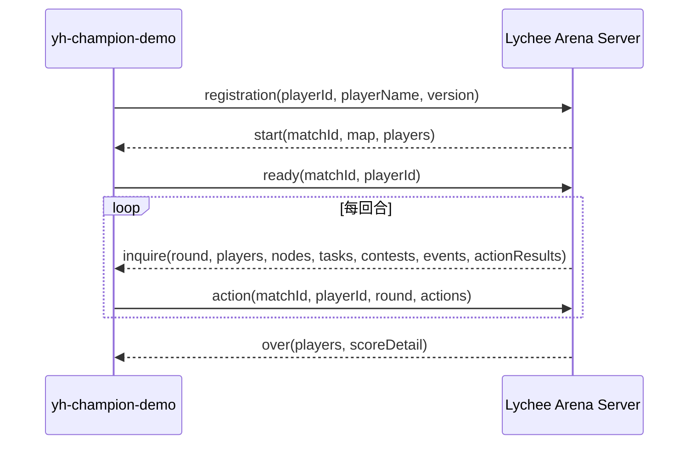

# yh-champion-demo SDD 设计文档

版本：2026-06-23  
状态：当前实现可构建、可测试、可提交；策略按动态地图和实时对手状态规划。

## 1. 目标与边界

`yh-champion-demo` 是 Java 21 参赛客户端，目标是在未知地图和未知对手下稳定完成验核、交付、任务补分和资源控制。

必须满足：

- 工程位于 `Lychee-Demo/official-battle-demo/yh-champion-demo`。
- Maven `artifactId`、jar、zip 和启动脚本均使用 `yh-champion-demo`。
- 不保留 `legacy` 目录。
- 不把 `champion-battle-demo.jar` 作为本项目产物。
- Markdown 文档使用中文。
- 每局对战输出目录写入 `analysis.md`。
- 回放分析由 AI 阅读结果、日志和回放后形成，不使用脚本生成结论。
- 生产策略不得写死地图节点或固定对手客户端。

不做：

- 不修改比赛服务端规则。
- 不依赖其他 demo 的源码运行。
- 不使用非法协议字段、重复登录、阻塞服务端或超时拖延获利。
- 不为了局部低价值机会牺牲交付闭环。

## 2. 输入资料

设计依据来自：

- `team-agent-document` 下的参赛选手任务书、通信协议、游戏逻辑设计文档和附录。
- `battle-demo/server` 的竞技场服务端行为。
- `battle-demo/client` 下历史对战样本。
- 已完成对战的 `data.csv`、`replay.txt`、`debug_replay.txt` 和客户端日志。

历史对战样本只用于回归验证，不写入生产策略分支。

## 3. 需求追踪

| 编号 | 需求 | 实现位置 | 验收证据 |
| --- | --- | --- | --- |
| REQ-PROTO-001 | TCP 长连接使用 5 位长度前缀和 UTF-8 JSON | `LengthPrefixedJson*` | 协议单测 |
| REQ-PROTO-002 | 支持 registration、start、ready、inquire/action、over 流程 | `NettyGameClient`、`ProtocolMessages` | 本地对战 |
| REQ-PROTO-003 | action 回传 `matchId`、`round`、`playerId` | `ProtocolMessages` | 单测和对战无协议拒绝 |
| REQ-MAP-001 | 从 `start.map.nodes` 和 `start.map.edges` 构建路线图 | `MapGraph.fromStart` | 动态地图单测 |
| REQ-MAP-002 | 从节点元数据识别起点、处理站、验核点和终点 | `MapGraph.updateNodes` | 动态处理站、动态验核、动态终点单测 |
| REQ-MAP-003 | 地图元数据缺省时使用拓扑兜底，不写固定节点 | `MapGraph.nearestGate`、`nearestTerminal` | 旧样例回归测试 |
| REQ-GAME-001 | 未验核时规划到动态验核点，验核后规划到动态终点 | `YhChampionPlannerAgent` | 动态地图单测 |
| REQ-GAME-002 | 提高任务分，优先冲任务分里程碑 | 任务评分与绕路预算 | 策略单测 |
| REQ-GAME-003 | 避免 PROCESS、资源、任务和验核对象死锁 | 冲突记忆和退避逻辑 | PROCESS 单测 |
| REQ-GAME-004 | 对远端已失先手机会停止盲追 | 对手到达估计 | 抢点过滤单测 |
| REQ-GAME-005 | 对手策略通用化，只读实时状态 | 对手建模 helper | 动态和历史回归测试 |
| REQ-GAME-006 | 小队清障不能破坏仍可完成的清障任务 | 小队动作选择和任务可行性判断 | 清障任务保护单测 |
| REQ-GAME-007 | 早期开局提高可争高价值路线桶锚点优先级 | 早期任务评分和路线桶加权 | 路线桶锚点单测 |
| REQ-PKG-001 | 产物名与项目名一致，根目录不放启动脚本 | `pom.xml`、`package/start.sh` | `package/yh-champion-demo.zip` |
| REQ-DOC-001 | 文档中文且能支撑开发 | README、SDD、回放分析 | 本文档 |
| REQ-BATTLE-001 | 对战输出目录包含分析结果 | 输出目录 `analysis.md` | 历史样本目录 |

## 4. 通信协议设计

每条 TCP 消息格式：

```text
5 位 ASCII 十进制长度前缀 + UTF-8 JSON body
```

约束：

- 长度只表示 body 的 UTF-8 字节数。
- 读取时先读满 5 字节，再按长度读满 body。
- 不能假设一次 TCP read 等于一条消息。
- body 最大长度为 99999 字节。
- JSON 解析失败只影响协议层，不进入策略层。

消息流程：



## 5. 地图语义设计

### 5.1 数据来源

`MapGraph` 读取以下数据：

- `start.map.nodes`
- `start.map.edges`
- `start.nodes`
- `start.edges`
- `inquire.nodes`
- `inquire.edges`

静态地图来自 `start`，动态障碍、守卫和补充节点状态来自 `inquire`。后续 `inquire` 不应抹掉已经学习到的节点语义，只更新动态状态。

### 5.2 节点语义

节点角色从字段推导：

| 角色 | 字段来源 |
| --- | --- |
| 起点 | `start=true` 或 `nodeType=START` |
| 终点 | `terminal=true` 或 `nodeType=FINISH/TERMINAL` |
| 验核点 | `nodeType=GATE` 或 `processType=VERIFY/VERIFY_GATE` |
| 处理站 | `processRound > 0` 且处理类型为站点流程，或处理类型缺省但给出了处理轮数 |
| 障碍 | `hasObstacle=true` |

如果旧样例缺少节点元数据，则只启用拓扑兜底：

- 未显式给出验核点时，未验核目标使用从当前位置可达的最远叶子节点。
- 已显式给出终点但未给验核点时，验核点使用终点前一跳。
- 未显式给出终点时，终点使用从当前位置可达的最远叶子节点。

兜底只用于信息缺省场景，真实比赛应优先依赖服务端下发的节点元数据。

### 5.3 路线成本

`MapGraph` 使用 Dijkstra 计算下一跳和距离，并按路线类型模拟服务端移动成本。

| 路线 | 策略含义 |
| --- | --- |
| ROAD / OFFICIAL_ROAD | 稳定主路 |
| WATER | 中前段抢节奏和资源窗口 |
| MOUNTAIN | 支线和绕冲突 |
| BRANCH | 逻辑短边，必须结合真实成本 |
| PALACE_ROAD | 后段主路 |

天气惩罚来自 `weather.active` 和 `weather.forecast`，对受影响路线类型加倍计算。

## 6. 决策流水线

每次 `onInquire` 的顺序：

1. 更新地图边、节点动态状态和本地记忆。
2. 消费 `events`、`messages`、`actionResults`。
3. 定位己方 player。
4. 处理已交付、移动中、忙碌、当前位置缺失等安全状态。
5. 如果当前是处理站，优先处理站点任务、退避、`PROCESS`。
6. 如果到达动态终点且已验核，`DELIVER`。
7. 如果到达动态验核点且未验核，`VERIFY_GATE`。
8. Rush 阶段判断提速、保鲜和破令。
9. 判断设卡、破卡、强通。
10. 处理当前任务、当前资源、可用库存资源。
11. 评估远端任务绕路。
12. 评估远端资源绕路。
13. 默认向动态目标推进，遇障碍则清障。
14. 合法附加窗口牌和小队动作。

核心原则：先执行确定合法和必须执行的动作，再考虑机会型绕路，最后回到交付闭环。

小队动作属于附加动作，只能提升主车队收益，不能抢掉主车队可完成的任务。若路线前方障碍点同时满足以下条件，则小队不发送 `SQUAD_CLEAR`：

- `tasks` 中存在同节点 `CLEAR_OBSTACLE` 任务。
- 任务仍处于 `active=true` 且未 `completed/failed`。
- 任务有正分值，并且己方当前资源、新鲜度和过期轮次允许完成。

这样可以保留主车队到点后的任务窗口；若该障碍没有可得分清障任务，仍允许小队提前清理纯阻塞点，维持交付节奏。

## 7. 任务策略

任务价值由以下因素组成：

```text
任务价值 =
  边际任务分
  + 任务类型收益
  + 里程碑增益
  - 处理轮数成本
  - 绕路成本
  - 过期风险
  - 对手抢先风险
```

规则：

- 当前节点可完成任务优先。
- 原始任务分不足阈值时放宽绕路预算。
- 任务需要马类或通行类燃料时，先保留资源，不随意作为移动加速使用。
- 对手明显先到远端任务点时停止追逐。
- 对手正在前往某任务点但尚未形成确定先手时，提高同窗竞争优先级。
- 任务已完成、失败、过期或本地标记放弃时不再追。
- 低价值任务不能破坏交付档位。

早期任务分支不绑定固定节点。策略会从所有可达任务中选择：

- 仍在早期窗口。
- 我方任务分较低。
- 可在过期前到达并完成。
- 对手不能在我方到达前稳定完成；路线桶收益只能提高可争任务的优先级，不能覆盖已输窗口。
- 若任务是早期 WATER/MOUNTAIN 路线桶锚点，且我方原始任务分仍为 0，则在任务仍可争时增加路线桶价值；若对手预计先完成或已经占住该节点，则仍跳过。
- 任务价值、处理类型和同窗竞争收益更高。

## 8. 资源策略

| 资源 | 策略 |
| --- | --- |
| FAST_HORSE | 任务燃料优先，其次关键移动加速 |
| SHORT_HORSE | 中短距离提速和后段压缩 |
| ICE_BOX | 鲜度较低或终点前保鲜 |
| PASS_TOKEN | 任务门槛、窗口牌、通行机会 |
| OFFICIAL_PERMIT | 任务门槛、窗口牌、官方路线机会 |
| INTEL | 仅在能降低风险时使用 |
| BOAT_RIGHT | 主要作为任务或窗口上下文资源 |

禁止：

- 已可交付时浪费资源动作。
- 为低价值资源长距离绕路。
- 明显落后对手时追远端公开资源。

## 9. 对手建模

生产策略不判断对手名称、jar 名、脚本名或固定客户端版本。

可使用的对手信息：

- `currentNodeId`
- `nextNodeId`
- `state`
- `edgeTotalMs`
- `edgeProgressMs`
- `score` / `taskScore`
- `verified`
- `delivered`
- 资源和窗口牌可用性

远端抢点过滤：

```text
opponentArrival + 2 <= selfArrival
```

若成立，认为对手明显先到，远端任务停止追逐。早期开局的 WATER/MOUNTAIN 路线桶锚点只在任务窗口仍可争时加权；路线桶收益不能覆盖已经输掉的单任务窗口。

## 10. PROCESS 冲突策略

处理站 busy 常见原因：

- `OBJECT_BUSY`
- `ROUND_CONFLICT`
- 任务或资源对象 busy 被误判为站点 busy

处理原则：

- busy payload 能给出 owner 剩余轮数时，按剩余轮数退让。
- 同轮冲突按站点处理时间和 playerId 做错峰。
- 不把任务对象 busy 误判为站点 busy。
- 不长期固定等待，避免双方同步死锁。

## 11. 守卫、破卡和窗口

守卫策略：

- 起点、终点、验核点不设卡。
- 仅在动态目标路径上的关键汇合点、关口或处理站考虑设卡。
- 若上游己方守卫仍能阻挡对手，不重复补卡。
- 若对手已经贴近当前点，允许当前点补卡。
- 若对手已经越过当前设卡点，保主线节奏。

破卡策略：

- 移动中遇到敌方 guard，优先判断 `BREAK_GUARD`。
- 资源不足或时间紧时考虑 `FORCED_PASS`。
- guard 记忆由服务端成功事件清理。

窗口策略：

- 必须绑定合法 `contestId`。
- 高价值 gate、resource、task 窗口优先。
- 低价值或明显劣势窗口可放弃。
- Rush 阶段可绑定 `BREAK_ORDER` 缩短关键窗口。

## 12. Rush 策略

Rush 只由当前局面触发：

- 未验核且动态验核点距离偏长，考虑 `RUSH_SPEED`。
- 已验核且动态终点距离偏长，考虑 `RUSH_SPEED`。
- 鲜度低于保护阈值，考虑 `RUSH_PROTECT`。
- 验核点同窗竞争且可用水果，考虑错峰等待后绑定 `BREAK_ORDER`。

## 13. 本地记忆

本地记忆包括：

- 已完成处理站。
- 放弃的任务和资源。
- 最近 PROCESS 冲突计数。
- 最近被设卡阻塞的节点。
- 验核 `BREAK_ORDER` 是否已使用。
- 已派遣小队目标。
- 最近 claim 失败原因。

本地记忆必须被服务端事件校正，不能长期覆盖真实状态。

## 14. TDD 与 SDD 开发流程

每个策略改动必须：

1. 从规则、回放或失败用例提取行为。
2. 写最小失败测试。
3. 确认测试红灯。
4. 写最小生产代码或配置改动。
5. 目标测试绿灯。
6. 运行全量 `mvn test`。
7. 运行 `mvn package`。
8. 若涉及实战收益，运行对应对战验证。
9. 更新 SDD、README 或回放分析。

本轮新增关键测试：

- 动态处理站来自 start 地图，而不是固定节点。
- 动态验核点来自 start 地图，而不是固定节点。
- 动态终点来自 start 地图，而不是固定节点。
- 旧官方地图样例只在测试 helper 中补节点元数据，生产策略不依赖该补丁。
- 小队不会提前清掉仍可由主车队完成并得分的 `CLEAR_OBSTACLE` 任务障碍。
- 早期任务分为 0 时提高可争 WATER/MOUNTAIN 路线桶锚点优先级；若对手预计先完成该单个任务，则切回其他可争任务。

## 15. 测试矩阵

当前全量测试：

```text
87 tests, 0 failures
```

覆盖范围：

- 协议消息结构。
- 5 位长度前缀编解码。
- 参数解析。
- `package/start.sh` 产物名，且根目录不存在 `start.sh`。
- 动态地图语义。
- 地图路线成本。
- 策略表加载和内置兜底。
- 当前任务、远端任务、资源、守卫、PROCESS、Rush、ICE_BOX、DOCK 等策略边界。

## 16. 对战验证矩阵

历史输出目录：

```text
D:\Lychee-game\Lychee-Demo\battle-demo\result\yh-final-client4-20260622-203621
```

服务端参数共性：

```text
server: battle-demo/server/Lychee-Arena-Server-1.0.0-SNAPSHOT.jar
seed: 2026062205
camp-policy: fixed
```

历史样本结果：

| 序号 | 对手 | 输出目录 | YH | 对手 | 结果 |
| ---: | --- | --- | ---: | ---: | --- |
| 1 | champion_agent.py | 01-champion-agent-python | 498 | 80 | YH 胜 |
| 2 | champion-battle-demo.jar | 02-champion-battle-demo-jar | 683 | 497 | YH 胜 |
| 3 | Lychee-Arena-L5-Client-1.0.0-SNAPSHOT.jar | 03-l5-client-jar | 603 | 444 | YH 胜 |
| 4 | official-l6-champion-planner-java-client.jar | 04-l6-client-jar | 701 | 428 | YH 胜 |

说明：

- 历史样本用于回归，不代表策略只服务这些对手。
- 每个输出目录均包含 `analysis.md`。
- 若服务端异常导致缺少 `data.csv`，必须在分析中引用回放末帧或日志中的胜负证据。

## 17. 回放分析规范

每个输出目录应包含：

```text
data.csv
replay.txt
debug_replay.txt
analysis.md
```

`analysis.md` 必须写清：

- 最终总分和分项。
- 胜负原因。
- 关键行动链。
- 是否存在非法动作、缺类异常或明显浪费。
- 本局是否产生策略改动。
- 若改动失败，是否已回滚。

禁止用脚本自动生成分析结论。可以用命令读取日志和结果，但最终判断必须由 AI 手工分析。

## 18. 构建与交付

构建：

```powershell
cd D:\Lychee-game\Lychee-Demo\official-battle-demo\yh-champion-demo
mvn test
mvn package
```

交付物：

```text
target/yh-champion-demo.jar
target/start.sh
package/yh-champion-demo.jar
package/start.sh
yh-champion-demo.zip
```

zip 内部只包含：

```text
yh-champion-demo.jar
start.sh
```

交付审计：

- 不含 `legacy` 目录。
- 不含旧名提交产物 `champion-battle-demo.jar`。
- `start.sh` 指向 `yh-champion-demo.jar`。
- Markdown 为中文。
- 历史对战输出目录均含 `analysis.md`。

## 19. 后续优化方向

1. 增加更多随机 seed 和地图结构验证。
2. 扩大动态地图元数据异常场景测试。
3. 继续减少后段拥塞，避免任务补分导致交付掉档。
4. 在不影响交付闭环的前提下寻找顺路任务分。
5. 每次只保留实战增益明确的规则；失败实验必须回滚并记录。
