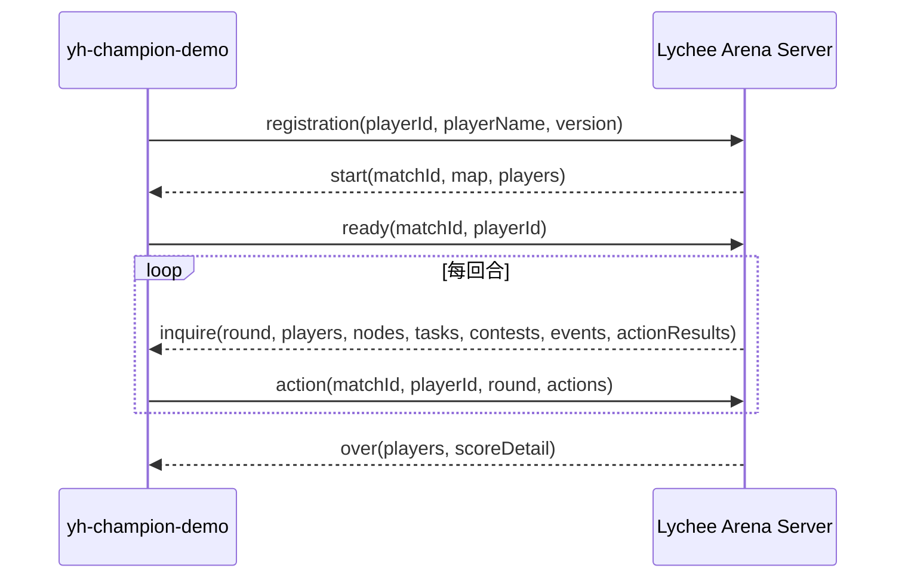

# yh-champion-demo SDD 设计文档

版本：2026-06-22  
状态：当前实现可构建、可对战、可提交；后续策略优化继续按本文执行  
项目目录：`D:\Lychee-game\Lychee-Demo\official-battle-demo\yh-champion-demo`

## 1. 目标与边界

`yh-champion-demo` 是“一骑红尘：荔枝争运战”的 Java 参赛客户端。设计目标是稳定交付、高任务分、低非法动作、可复盘迭代，并在用户最新指定的 `battle-demo/client` 四个对手上全胜。

必须满足：

- 工程位于 `Lychee-Demo/official-battle-demo/yh-champion-demo`。
- Maven `artifactId`、最终 jar、zip 和启动脚本均使用 `yh-champion-demo`。
- 不保留 `legacy` 目录。
- 不把 `champion-battle-demo.jar` 作为本项目产物；它只作为 `battle-demo/client` 下的对手名称出现。
- Markdown 文档使用中文。
- 每局对战输出目录写入 `analysis.md`。
- 回放分析由 AI 手工阅读结果、日志和回放后完成，不使用脚本生成分析结论。
- 当前验收范围只包含 `battle-demo/client` 下 4 个对手，不运行 `official-tier-demos`。

不做：

- 不修改比赛服务端规则。
- 不依赖其他 demo 的源码运行。
- 不使用非法协议字段、重复登录、阻塞服务端或超时拖延获利。
- 不为了局部低价值抢分牺牲交付闭环。

## 2. 资料依据

设计依据来自：

- `team-agent-document` 下的参赛选手任务书、通信协议、游戏逻辑设计文档和附录。
- `battle-demo/server` 的竞技场服务端和地图配置。
- `battle-demo/client` 下 4 个对手：
  - `champion_agent.py`
  - `champion-battle-demo.jar`
  - `Lychee-Arena-L5-Client-1.0.0-SNAPSHOT.jar`
  - `official-l6-champion-planner-java-client.jar`
- 已完成对战的 `data.csv`、`replay.txt`、`debug_replay.txt` 和客户端日志。

## 3. 需求追踪

| 编号 | 需求 | 实现位置 | 验收证据 |
| --- | --- | --- | --- |
| REQ-PROTO-001 | TCP 长连接使用 5 位长度前缀加 UTF-8 JSON | `LengthPrefixedJson*` | 协议单测通过 |
| REQ-PROTO-002 | 支持 registration、start、ready、inquire/action、over 流程 | `NettyGameClient`、`ProtocolMessages` | 本地对战完成 |
| REQ-PROTO-003 | action 回传 `matchId`、`round`、`playerId` | `ProtocolMessages` | 单测和实战无协议拒绝 |
| REQ-GAME-001 | 稳定完成 S14 验核与 S15 交付 | `YhChampionPlannerAgent` | 四场对战均完成或提前锁定胜局 |
| REQ-GAME-002 | 提高任务分，优先冲 90+ 原始任务分 | 任务评分、里程碑与绕路预算 | L5 90 分、L6 140 分 |
| REQ-GAME-003 | S04 开局水路争夺，压制 L5 节奏 | `openingS04WaterContestTask` | L5 从败局修复为 603:444 胜 |
| REQ-GAME-004 | S04 已明显失先手时切 S03 反制 | S03 兜底 helper | 对应单测 |
| REQ-GAME-005 | DOCK 第三牌保留有效牌 | 策略配置与内置兜底 | L5 窗口修复 |
| REQ-GAME-006 | 避免 PROCESS、资源、任务和 gate 死锁 | 冲突记忆和退让逻辑 | PROCESS 单测与回放 |
| REQ-GAME-007 | 路线成本接近服务端真实结算 | `MapGraph` | 路线单测和对战结果 |
| REQ-GAME-008 | 对远端已失先手节点停止盲追 | 抢点过滤 | S09/S04/S05 测试和回放 |
| REQ-PKG-001 | 产物名与项目名一致 | `pom.xml`、`start.sh` | `target/yh-champion-demo.jar` |
| REQ-DOC-001 | 文档中文化且能支撑开发 | README、SDD、复盘 | 本文件和回放分析 |
| REQ-BATTLE-001 | 使用 battle-demo 服务端对战四个 client | 本地输出目录 | 四局全胜，均有 `analysis.md` |

## 4. 通信协议设计

### 4.1 帧格式

每条消息格式：

```text
5 位 ASCII 十进制长度前缀 + UTF-8 JSON body
```

约束：

- 长度只表示 body 的 UTF-8 字节数。
- 读取时先读满 5 字节，再按长度读满 body。
- 不能假设一次 TCP read 等于一条消息。
- body 最大长度为 99999 字节。
- JSON 解析失败只影响协议层，不进入策略层。

### 4.2 消息流程



### 4.3 start 缓存

收到 `start` 后缓存：

- `matchId`
- `players`
- `map`
- `nodes`
- `edges`
- `resources`
- `taskTemplates`

`inquire` 提供动态状态。若动态边存在，优先覆盖静态边。

### 4.4 action 输出原则

主车队每帧最多一个主动动作。移动、处理、验核、争夺、休整、已交付等忙碌状态默认只发安全心跳，除非需要处理移动中设卡或合法窗口牌。

已交付后不再提交任务、资源、小队或重复交付动作。

## 5. 模块职责

| 模块 | 职责 |
| --- | --- |
| `YhChampionClientApplication` | 程序入口，装配配置、网络客户端和策略代理 |
| `YhChampionConfig` | 命令行参数、环境变量、默认值解析 |
| `NettyGameClient` | TCP 连接、注册、ready、inquire/action 主循环 |
| `LengthPrefixedJsonFrameDecoder` | 5 位长度前缀解码 |
| `LengthPrefixedJsonFrameEncoder` | 5 位长度前缀编码 |
| `ProtocolMessages` | registration、ready、action 消息构造 |
| `RoleActionCommand` | 业务动作对象，约束动作字段 |
| `MapGraph` | 地图节点、边、最短路、下一跳和天气成本 |
| `GrandmasterStrategyTables` | 策略配置、卡牌表、资源偏好和兜底配置 |
| `YhChampionPlannerAgent` | 核心决策、记忆、冲突处理、任务和资源评估 |

## 6. 地图和路线设计

### 6.1 路线成本

`MapGraph` 使用 Dijkstra 计算下一跳和距离，并按路线类型模拟服务端移动成本。

| 路线 | 特性 | 策略含义 |
| --- | --- | --- |
| ROAD | 稳定，任务密集 | 适合作为失去水路窗口后的反制 |
| WATER | 中前段快，资源收益好 | 当前主线，适合高质量交付和任务补分 |
| MOUNTAIN | 可绕开部分冲突 | 作为中局补分和支线机会 |
| BRANCH | 逻辑距离可能短 | 必须结合真实边成本，不盲用 |

### 6.2 强制处理站点

以下节点必须 `PROCESS` 后才能继续：

```text
S02, S04, S05, S11, S13
```

重要结论：S02 不能跳过。实战实验中跳过 S02 会导致服务端反复拒绝 S02 -> S03 移动，分数下降。

### 6.3 终局路线

终局目标：

1. 未到 S14 时先到 S14。
2. 在 S14 且未验核时 `VERIFY_GATE`。
3. 验核完成后移动到 S15。
4. 在 S15 `DELIVER`。
5. 已交付后只发安全心跳。

## 7. 本地记忆

本地记忆包括：

- 已完成的强制处理站。
- 放弃的任务和资源。
- 最近 PROCESS 冲突计数。
- 最近被设卡阻塞的节点。
- gate `BREAK_ORDER` 是否已绑定。
- 已派遣小队目标，防止重复派遣。
- 最近任务/资源 claim 失败原因。
- 窗口出牌历史。

本地记忆必须被服务端事件校正，不能长期覆盖真实状态。

## 8. 决策管线

每次 `onInquire` 执行顺序：

1. 消费 `events` 与 `actionResults`，更新本地记忆。
2. 定位己方 player。
3. 忙碌状态安全门控。
4. 当前节点任务。
5. 当前库存资源使用。
6. 当前节点资源。
7. 强制 PROCESS。
8. 终局与 Rush 动作。
9. 设卡、破卡和强通。
10. 任务绕路。
11. 资源绕路。
12. 默认向 S14 或 S15 推进。
13. 合法附加窗口或小队动作。

该顺序的核心是：先处理确定可执行和必须执行的动作，再考虑机会型绕路，最后回到交付闭环。

## 9. 任务策略

任务价值估算：

```text
taskValue =
  rawTaskScore
  + processTypeBonus
  + milestoneDelta
  - detourCost
  - processCost
  - expireRisk
  - opponentRaceRisk
```

规则：

- 当前位置可完成任务优先。
- 原始任务分不足 90 时放宽绕路预算。
- 任务需要马类或通行类燃料时，先保留资源，不随意作为移动加速使用。
- 对手明显先到远端任务点时停止盲追。
- 任务已完成、失败、过期或本地标记放弃时不再追。
- 低价值任务不能破坏交付档位。

任务里程碑：

```text
30 分：开局基础任务已完成，可以进入稳定主线。
60 分：任务分开始显著影响总分。
90 分：进入高收益档，优先级开始下降，避免过度绕路。
110+ 分：只保留顺路或高确定性任务。
```

## 10. 开局分支策略

### 10.1 S02 必须 PROCESS

S02 属于强制 `TRANSFER` 站点。即使 S03 或 S04 有早期任务，也必须等 `PROCESS_COMPLETE` 后再移动。

保留测试：

```text
keepsS02TransferBeforeEarlyRoadTaskChainBecauseServerRequiresIt
```

### 10.2 S04 水路争夺优先

适用条件：

- 当前在 S02。
- round <= 120。
- 原始任务分 < 30。
- S04 存在 WATER/CLAIM_TASK 且分值 >= 30。
- 对手尚未控制 S04。
- 对手不能在我方到达前完成 S04 任务。

动作：

```text
MOVE S04
```

作用：

- 抢 T_002 水路基础任务。
- 逼迫 L5 类对手进入 S04 DOCK 窗口。
- 为后续 S05/S09 水路任务建立节奏。

保留测试：

```text
contestsOpeningS04WaterTaskWhenOpponentLeadIsStillSmall
```

### 10.3 S04 已明显失先手时切 S03

适用条件：

- 当前在 S02。
- round 仍处于早期窗口。
- 对手明显先到 S04 或已控制 S04。
- S03 存在可做任务。
- 己方任务分压力仍高。

动作：

```text
MOVE S03
```

作用：避免继续追 S04/S05 低胜率窗口，改抢官道基础分和后续交付质量。

保留测试：

```text
switchesToS03RoadTaskWhenOpponentWinsEarlyS04WaterLead
```

## 11. 中局策略

中局从 S05/S09/S10 开始，目标是补足任务分并保持交付档位。

关键规则：

- S09 的 CLAIM_TASK 优先级高于远端低收益资源。
- S07 冰盒只有在不影响 S09/S10 窗口时才追。
- S10/S11/S13 附近任务若顺路且不降交付档位，可以补分。
- 对手已经明显占据任务节点时，不再同步撞窗口。

保留测试：

```text
skipsS07IceBoxWhenMidgameS09TaskWindowIsOpen
stopsChasingRemoteTaskWhenOpponentAlreadyControlsS09Window
skipsS09ResourceAndTaskWhenOpponentIsClearlyArrivingFirst
```

## 12. 资源策略

| 资源 | 价值 | 使用策略 |
| --- | --- | --- |
| FAST_HORSE | 极高 | 任务燃料优先，其次关键移动加速 |
| SHORT_HORSE | 高 | 中短距离提速和终局压缩 |
| ICE_BOX | 高 | 鲜度低或终局交付前保鲜 |
| PASS_TOKEN | 中高 | 任务门槛和关键通行 |
| OFFICIAL_PERMIT | 中高 | 任务门槛和官方路线机会 |
| INTEL | 中低 | 只在明确降低风险时使用 |

禁止：

- 在 S15 已可交付时浪费资源动作。
- 为低价值资源长距离绕路。
- 明显落后对手时追远端公开资源。

## 13. 远端抢点过滤

抢点过滤用于任务和资源：

```text
opponentArrival + 2 <= selfArrival
```

若成立，认为对手明显先到。对手到达估计优先使用：

- `edgeTotalMs`
- `edgeProgressMs`
- `currentNodeId`
- `nextNodeId`
- 从 `nextNodeId` 到目标节点的最短路

该过滤避免在 S09、S04、S05 等节点继续追逐已经被对手锁住的窗口。

## 14. PROCESS 冲突策略

PROCESS 相关失败常见原因：

- `OBJECT_BUSY`
- `ROUND_CONFLICT`
- 任务或资源对象忙碌被误判为站点 PROCESS 忙碌

处理原则：

- 若 busy payload 能给出 owner 剩余轮数，按剩余轮数退让。
- 若是同帧冲突，按站点处理时间和 playerId 做错峰。
- 不把任务对象 busy 误判为站点 busy。
- 不长期固定等待，避免双方同步死锁。

## 15. 守卫、破卡和窗口

守卫策略：

- 只在对手前进路径上的关键汇合点设卡。
- 若 S10 已有有效己方 guard 且对手仍在后方，不重复去 S11 冗余设卡。
- 若对手已经贴近 S10 -> S11 或进入下游，S11 设卡仍有价值。

破卡策略：

- 移动中遇到敌方 guard，优先判断 `BREAK_GUARD`。
- 如果资源不足或时间紧，考虑 `FORCED_PASS`。
- guard 记忆由服务端事件清理。

窗口策略：

- 必须绑定合法 `contestId`。
- 高价值 gate、resource、task 窗口优先。
- 低价值窗口或明显劣势窗口可放弃。
- 避免同一窗口同步重复出牌导致冷却浪费。

## 16. DOCK 窗口专项

L5 失利复盘显示，S04 DOCK 第三回合如果退化为低价值牌，会导致我方失去 S04 主动权，后续在 S05/S09 连续慢 4 到 6 回合。

当前配置：

```text
DOCK: QIANG_XING, YAN_DIE, XIAN_GONG
```

设计意图：

- 前两回合优先高压窗口。
- 第三回合仍保留 `XIAN_GONG`，避免旧策略落到 `BING_ZHENG`。
- 配置文件和内置兜底表保持一致，防止资源加载失败时回退旧行为。

保留测试：

```text
keepsXianGongOnThirdDockWindowWhenFuelCardsAreUnavailable
```

实战结果：

```text
L5 修复前：YH 527，L5 584，YH 负
L5 修复后：YH 603，L5 444，YH 胜
```

## 17. TDD 与 SDD 开发流程

每个策略改动必须：

1. 从回放或规则中提取具体失败行为。
2. 写最小失败测试。
3. 确认测试红灯。
4. 写最小生产代码或配置改动。
5. 目标测试绿灯。
6. 跑全量 `mvn test`。
7. 跑 `mvn package`。
8. 至少跑一局相关实战验证。
9. 若实战降分，回滚该规则和测试。
10. 更新 SDD、复盘和对应对战目录的 `analysis.md`。

已执行的典型 TDD：

- S02 不能跳过 PROCESS。
- S09 远端抢点过滤。
- S04/S05 丢水路先手后切 S03。
- S04 开局水路争夺。
- DOCK 第三牌保留 `XIAN_GONG`。
- S07 冰盒让路给 S09 中局任务。

## 18. 测试矩阵

当前全量测试：

```text
73 tests, 0 failures
```

覆盖：

- 协议消息结构。
- 5 位长度前缀编解码。
- 参数解析。
- `start.sh` 产物名。
- 地图路线成本。
- 策略表加载和内置兜底。
- 当前任务、远端任务、资源、守卫、PROCESS、Rush、S14/S15、ICE_BOX、DOCK 等策略边界。

关键新增测试：

```text
contestsOpeningS04WaterTaskWhenOpponentLeadIsStillSmall
keepsXianGongOnThirdDockWindowWhenFuelCardsAreUnavailable
switchesToS03RoadTaskWhenOpponentWinsEarlyS04WaterLead
rushesOpeningS03FoundationTaskEvenWhenNormalDetourBudgetWouldRejectIt
skipsS07IceBoxWhenMidgameS09TaskWindowIsOpen
```

## 19. 对战验证矩阵

输出目录：

```text
D:\Lychee-game\Lychee-Demo\battle-demo\result\yh-final-client4-20260622-203621
```

服务端参数共性：

```text
server: battle-demo/server/Lychee-Arena-Server-1.0.0-SNAPSHOT.jar
map: battle-demo/server/map_config.json
seed: 2026062205
camp-policy: fixed
red-player-id: 1001
blue-player-id: 2002
```

| 序号 | 对手 | 输出目录 | YH | 对手 | 结果 |
| ---: | --- | --- | ---: | ---: | --- |
| 1 | `champion_agent.py` | `01-champion-agent-python` | 498 | 80 | YH 胜 |
| 2 | `champion-battle-demo.jar` | `02-champion-battle-demo-jar` | 683 | 497 | YH 胜 |
| 3 | `Lychee-Arena-L5-Client-1.0.0-SNAPSHOT.jar` | `03-l5-client-jar` | 603 | 444 | YH 胜 |
| 4 | `official-l6-champion-planner-java-client.jar` | `04-l6-client-jar` | 701 | 428 | YH 胜 |

说明：

- 第 1、3、4 场有标准 `data.csv`。
- 第 2 场服务端在 GameOver 通知阶段出现缺类异常，未写出 `data.csv`；但 `debug_replay.txt` 最后一帧已进入 `phase=ENDED`，双方已交付，`scorePreview` 为 `RED=683, BLUE=497`，胜负确定。
- 每局输出目录均有 `analysis.md`。

## 20. 回放分析规范

每个输出目录应包含：

```text
data.csv
replay.txt
debug_replay.txt
analysis.md
```

若服务端异常导致缺少 `data.csv`，必须在 `analysis.md` 中明确说明，并引用回放最后帧的胜负证据。

`analysis.md` 必须写清：

- 最终总分和分项。
- 胜负原因。
- 关键行动链。
- 是否存在非法动作、缺类异常或明显浪费。
- 本局是否产生策略改动。
- 若改动失败，是否已回滚。

禁止用脚本自动生成分析结论。可以用命令读取日志和结果，但最终判断必须由 AI 手工分析。

## 21. 构建与交付

构建：

```powershell
cd D:\Lychee-game\Lychee-Demo\official-battle-demo\yh-champion-demo
mvn test
mvn package
```

交付物：

```text
target/yh-champion-demo.jar
target/start.sh
yh-champion-demo.zip
```

zip 内部至少包含：

```text
yh-champion-demo.jar
start.sh
README.md
docs/
```

交付审计：

- 不含 `legacy` 目录。
- 不含旧名提交产物 `champion-battle-demo.jar`。
- `start.sh` 指向 `yh-champion-demo.jar`。
- Markdown 为中文。
- 四个对战输出目录均含 `analysis.md`。

## 22. 后续优化方向

后续只围绕当前验收范围继续优化：

1. 对 L5/L6 保持 S04 水路窗口和 DOCK 牌序，不回退。
2. 继续减少 S13/S14 后段拥塞，避免任务补分导致交付掉档。
3. 在不影响交付闭环的前提下，寻找顺路任务分。
4. 扩展多 seed 验证时，必须保留当前固定 seed 四场全胜作为基线。
5. 每次只保留实战增益明确的规则，失败实验必须回滚并记录。
