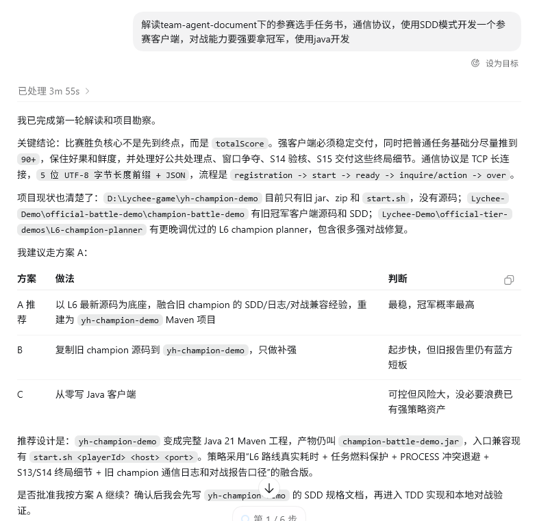
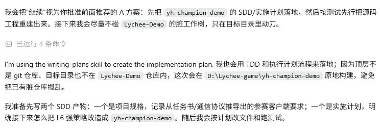
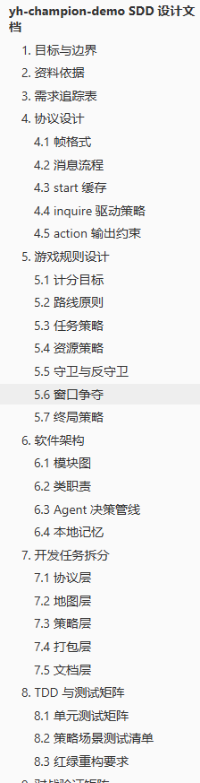
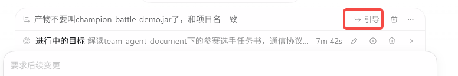
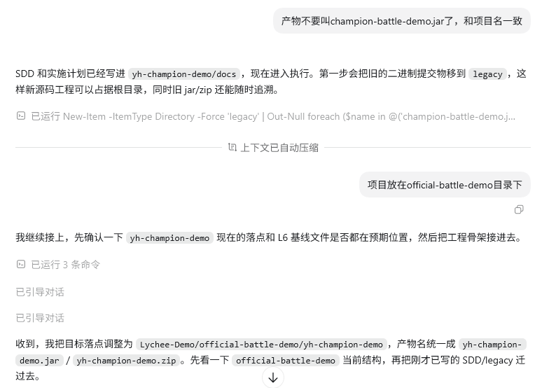
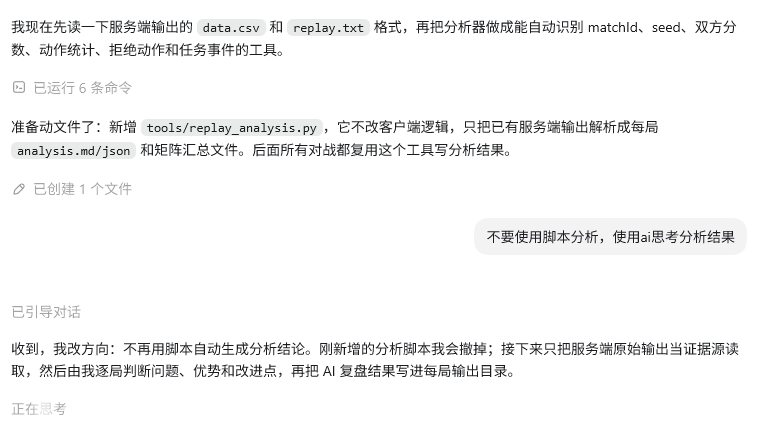
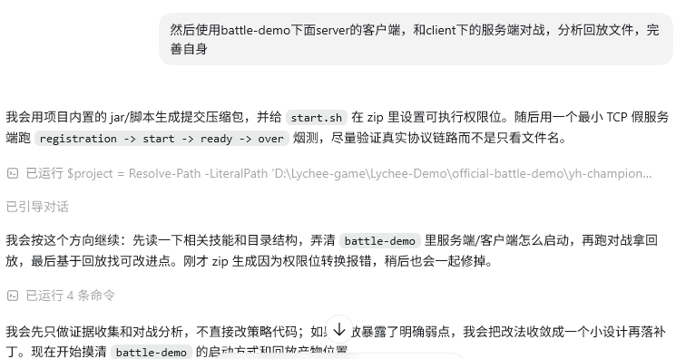
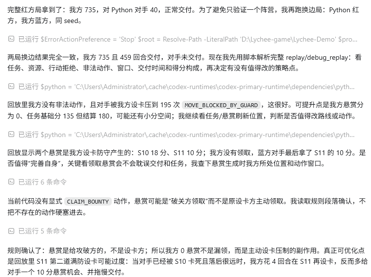
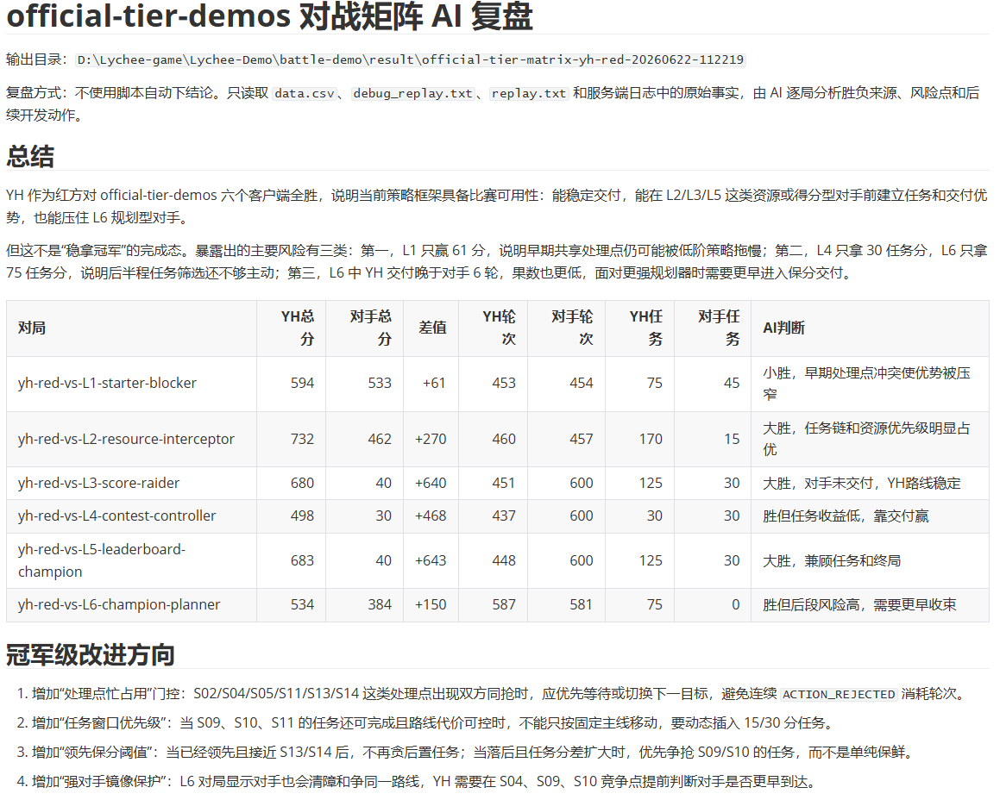

# 第一次用 Codex 做软件大赛项目：我的实践记录

## 一、背景

这次软件大赛项目，是我第一次比较完整地使用 Codex 辅助开发。项目本身不是一个简单 Demo，而是要阅读比赛文档和 `team-agent-document` 里的规则说明，做出一个 Java 参赛客户端，并且要符合通信协议、运行脚本、打包格式和对战验证要求。

一开始我对 Codex 的想法很直接：让它帮我写代码。真正用下来以后，我发现这个想法有点简单了。Codex 的价值不只是“生成代码”，更像是帮我把陌生项目拆开：先读文档，判断任务重点，再设计方案，最后一点点实现和验证。

我这次最深的感受是：用 AI 开发不能只追求速度。设计没想清楚，AI 很容易写出“看起来很完整，但方向不对”的代码；测试没做好，也很难判断代码是不是真的能交付。好的使用方式应该是：先把目标和边界设计清楚，再让 AI 按设计写代码，最后用真实测试把结果跑出来。

## 二、我实际使用 Codex 的过程

### 1. 先让 Codex 读懂任务

我没有一上来就让 Codex 写客户端，而是先让它阅读项目资料、比赛说明和现有目录。Codex 读完后先总结了任务重点：比赛看的不是单纯到达终点，而是 `totalScore`；客户端必须能稳定交付；协议流程、窗口处理、公共节点、打包方式这些细节都不能漏。

这一步很有用。因为我自己第一次看文档时，很容易只盯着“怎么移动”“怎么得分”，但 Codex 会把规则、工程和交付要求一起看。

它当时给了几个方案：从零写、复制旧工程补强、或者以已有冠军方案为底座重建。最后我选择了第三种：基于已有经验重建 Maven 工程，再把 SDD、日志、策略和打包流程整理进去。这个选择比较稳，尤其适合比赛项目。比赛不是练手写框架，能稳定交付才是第一位。

### 2. 先写设计和计划，再动代码

确定方向后，我让 Codex 先写 SDD 和实施计划。也就是说，先把项目目标、协议流程、目录结构、模块划分、测试方式都写清楚，再进入编码。

后面生成出来的 SDD 目录也比较完整，从目标、资料依据、协议设计、游戏规则、软件架构，一直到 TDD 和测试矩阵都有覆盖。

这一步让我意识到，AI 写代码的质量其实很依赖前面的设计。如果只说“帮我做一个参赛客户端”，它可能会补出很多自认为合理的东西；但如果先把协议、策略、目录和交付物写清楚，后面的代码会更容易检查，也更容易让 Codex 自己沿着同一个方向继续做。

### 3. 开发过程中持续纠偏

Codex 不是每一次都会完全理解我的隐含要求。比如我发现它一开始把产物叫成了 `champion-battle-demo.jar`，但我希望产物名称和项目名保持一致，所以我明确补充：“产物不要叫 `champion-battle-demo.jar`，和项目名一致。”

后面我又继续补充项目目录要求，比如项目要放在 `Official-battle-demo` 目录下，最终产物统一成 `yh-champion-demo.jar` 和 `yh-champion-demo.zip`。Codex 根据这些反馈调整了目录和打包方式。

这一段经历提醒我：用 Codex 时，用户不能只等结果。AI 可以给方案，可以写代码，但项目规范、命名、目录、交付要求这些细节，还是要自己盯住。尤其是软件大赛，很多错误不是代码逻辑错，而是 jar 名不对、脚本路径不对、zip 结构不对，最后平台根本跑不起来。

### 4. 分阶段生成代码

正式实现时，我没有让 Codex 一次性把所有东西写完，而是按阶段推进：

1. 先搭建 Java Maven 工程。
2. 再实现 TCP 长连接通信。
3. 按 `registration -> start -> ready -> inquire/action -> over` 处理比赛协议。
4. 接入地图、资源、任务和行动策略。
5. 保留日志和回放分析入口。
6. 最后处理 `start.sh`、jar 和 zip 交付包。

这样做比较踏实。每完成一块，就能检查一次：能不能编译，能不能启动，协议有没有走通，打包结构有没有问题。问题出现时也容易定位，不会变成一大堆代码混在一起不知道从哪里改。

### 5. 不让脚本替我下结论

中间有一次，Codex 准备写脚本自动分析 `data.csv` 和 `replay.txt`，我打断了它。我当时的要求是：不要只用脚本自动得出结论，而是让 AI 直接阅读原始输出，结合上下文判断问题。

这个地方我觉得挺重要。脚本适合做统计，但比赛策略的好坏不一定只靠一个数字判断。有些问题要看回放、看行动被拒绝的原因、看任务窗口和交付时机。让 Codex 结合原始日志复盘，能避免“脚本说没问题，但实际策略很弱”的情况。

### 6. 用真实对战验证，而不是只看代码

这次我最大的体会是：AI 生成代码以后，一定要跑。只通过编译不够，只看代码更不够。

我让 Codex 使用官方 `battle-demo` 下的 server/client 做本地联调，并且用 `start.sh` 验证真实启动流程。这样检查的不是某个 jar 文件能不能存在，而是整个交付包在接近评测环境的情况下能不能跑起来。

Codex 后面还做了多轮对战和回放分析：看双方分数、行动拒绝、非法动作、任务得分、窗口处理和交付结果。

最后还整理了对战矩阵复盘。这个结果很直观：有些对局能赢，说明基础策略已经有比赛可用性；但也暴露出一些问题，比如某些等级只靠任务分，后半程路线还不够主动，面对更强规划器时需要更早进入保分和交付。

这一步比单纯“代码写完了”更有价值。因为比赛项目真正要交付的是可运行、能对战、能得分的客户端，不是一堆看起来合理的 Java 文件。

## 三、我总结出的 Codex 使用方法

### 1. 先设计，再让 AI 写

第一次用 Codex，很容易直接输入“帮我写完整项目”。现在回头看，这种方式风险挺大。复杂一点的项目，尤其是比赛项目，最好先让 Codex 做三件事：

- 读文档和目录。
- 总结任务目标、限制条件和交付要求。
- 给出几个方案，并说明取舍。

等方向确定后，再让它写 SDD 或实施计划。这样后面的代码不是凭空生成，而是有一个明确的“施工图”。

### 2. 需求要具体，最好能检查

我这次给 Codex 的约束越具体，它的输出越可靠。比如：

- 使用 Java 和 Maven。
- 项目名和产物名保持一致。
- 按比赛协议完成 `registration`、`start`、`ready`、`action`、`over`。
- 最终要有 jar、`start.sh` 和 zip。
- 用官方 `battle-demo` 做本地联调。
- 用回放和对战矩阵验证策略。

这些要求都有一个共同点：能检查。能不能编译，能不能启动，文件名对不对，协议有没有走通，回放里有没有非法动作，都可以验证。需求越能被验证，AI 开发越不容易跑偏。

### 3. 用户要负责判断

Codex 能给出建议，但不能替我负责比赛结果。比如目录放哪里、产物叫什么、是否符合交付规范、策略是否真的有效，这些都需要我判断。

我觉得比较好的配合方式是：让 Codex 做大量阅读、实现和初步分析，我负责确认方向、补充约束、检查结果。它像一个执行力很强的开发助手，但最终拍板的人还是我。

### 4. 让 Codex 同时写验证方式

只让 Codex 写代码是不够的。更好的做法是同时要求它写：

- 编译命令。
- 启动脚本。
- 本地联调方法。
- 回放分析方法。
- 打包和交付检查清单。

这样每次改完都能快速回归。尤其是比赛项目，策略经常要调，如果没有固定的验证方式，每次都靠手动试，后面会很混乱。

### 5. 真实环境验证比“看起来没问题”更重要

这次项目里，我最后更相信对战结果，而不是代码本身。代码写得再整齐，如果 `start.sh` 起不来，或者协议流程没走完，或者回放里大量 `ACTION_REJECTED`，那都不能算完成。

所以我的验证标准大概是：

- Maven 编译通过。
- jar 能启动。
- `start.sh` 能被调用。
- TCP 协议流程完整。
- 能和官方 server/client 通信。
- replay 能证明行动合法。
- 多轮对战结果能解释清楚。
- 最终 zip 结构符合交付要求。

## 四、使用后的感受

Codex 对我这种第一次接触比赛工程的人帮助很大。它读文档快，能快速搭工程，也能根据日志继续分析问题。最重要的是，它能把一个看起来很乱的任务拆成几个可以做的小步骤。

但我也不会把它当成“自动开发机”。它有时候会猜错命名，有时候会按照自己的习惯补东西，有时候也会过早相信脚本统计。这个时候就需要我把要求说清楚，并且用测试把结果压实。

所以我现在对 AI 开发的理解很简单：AI 根据好的设计输出代码，再通过好的测试验证功能。设计和验证都不能省。前者决定 AI 往哪里写，后者决定结果能不能交。

## 五、给第一次使用 Codex 的建议

1. 不要一开始就让 Codex 写完整项目，先让它读文档、读目录、总结任务。

2. 遇到复杂项目，先让 Codex 给方案，再选一个风险最低、最符合交付目标的方案。

3. 写代码前先写设计文档或实施计划，哪怕不长，也要把协议、目录、产物和测试方式说明白。

4. 每次生成代码后，都要求 Codex 编译、运行、联调，不要只停在“代码已生成”。

5. 对产物名、目录结构、脚本入口、zip 内容这些交付细节要自己检查。

6. 日志和回放不要只看结论，要看原始原因，比如行动为什么被拒绝、任务为什么没交付、分数从哪里来。

7. 优化策略前先复盘，不要凭感觉让 AI “再增强一下”。

8. 最后一定要模拟真实评测环境完整跑一遍。

## 六、总结

这次项目让我觉得，Codex 最适合做“开发协作者”，而不是替代开发者。它能帮我更快地理解项目、生成代码、补脚本、查日志，但前提是我得把目标讲清楚，也要愿意检查它的结果。

如果把这次经验整理成一条流程，我会写成：

> 阅读文档 -> 分析需求 -> 比较方案 -> 写设计 -> 生成代码 -> 编译运行 -> 联调验证 -> 分析日志和回放 -> 迭代优化 -> 打包交付。

这也是我这次最大的收获：AI 开发真正可靠的地方，不在于它一次能写多少代码，而在于我们能不能把设计、实现和验证连成一个闭环。
